# S1-10: مخططات هندسة البرمجيات (DIAGRAMS)

- **الحالة:** معتمدة — المخططات الستة معتمدة (حكم المالك 2026-11-08 — D-2، بعد موجة الإصلاح 0e4a3e2..f7da470)؛ والمواصفة معتمدة بالكامل في التخطيط [تحديث 2026-11-17 (Q-406): أُغلق تصميم النظام؛ وأُعيد رسم المخططات 2026-11-17 لتطابق Q-405/Q-406 (REQ-032/033، الكيانان `custom_mode` و`mode_session`).] [تحديث 2026-11-19 (Q-419 · Q-434): أُضيف كشف التعارض عند الحفظ وبطاقته (UC20/UC21، 3-ل، 3-م، وفروع §4/§6)؛ وأُعيد ضبط الشكل على قواعد §3 (لوحات ≤20 عقدة، وتسلسلات ≤20 رسالة، وERD مجموعتان). المفاتيح 94 والمتطلبات 219 ثابتة.]
- **المواصفة:** `SPEC.md` (§§1–8 + §10 معتمدة بالكامل في التخطيط)
- **السياق المحدد (Bounded Context):** #3 الحماية والتحكم بالجهاز (Child Protection) — `CONTEXT-MAP.md` §2 صف 3
- **القرارات الحاكمة:** Q-001 · Q-007 · Q-134 (هيكل الملف) · Q-002 · Q-031 · Q-061 · Q-065 · Q-067 · Q-106 · Q-141 · Q-142 · Q-143 · Q-144 · Q-145 · Q-146 · Q-168 · Q-343 · Q-405 · Q-406 · Q-419 · Q-426 · Q-431 · Q-434
- **الأنواع الستة:** 1. حالات الاستخدام · 2. ERD · 3. التسلسل · 4. تدفق المستخدم · 5. DFD · 6. النشاط
- **الأشكال الموحدة:** مستطيل = جهة خارجية · مستطيل مستدير = عملية · معين = قرار · أسطوانة = مخزن بيانات · خط متقطع = يتضمن / اختياري

## 1. حالات الاستخدام (REQ-001/002/003/006/010/011/013/018/024/032/033 — Q-419)

يُقرأ منه: من يفعل ماذا في الحماية والفرض — الأهل يديرون القواعد والأوضاع، والأبناء يستخدمون التطبيقات ويطلبون وقتاً، ووحدة الفرض تقيّم وتكشف العبث.

21 حالة استخدام من السيناريوهات الثمانية والمتطلبات (§2/§3): الأب ينشئ القواعد والجداول ويرتب الأنواع ويفعّل الوضع الحر وينشئ الأوضاع الخاصة ويطبّق الأوضاع؛ والبالغ المفوَّض يدير القواعد حسب القالب (حذف القاعدة وإعادة الترتيب قابلان للتفويض — Q-146)؛ والوضع الحر للمالك وحده (Q-143)؛ والطفل والمراهق يفتحان التطبيقات ويطلبان وقتاً إضافياً دون اتصال؛ وأي محاولة تعطيل تتضمن تنبيهاً فورياً وإعادة تفعيل. والتسليم إلى S1-05 (دورة النقاط) وS1-09 (البطاقات والتنبيهات) ممثلان كجهات خارجية. والوضع الحر والأوضاع الجاهزة والخاصة تُطبَّق من شاشة واحدة «الأوضاع» (S10-09 وS10-10 سطح واحد — Q-405). وكشف التعارض عند الحفظ (UC20) يتضمنه كل حفظ في هذا النظام (قاعدة تطبيق، جدول، ترتيب، حصة، تصفية ويب، استثناء موقع، وضع خاص، تطبيق وضع)؛ وصفحة تعارضات قواعد الطفل (UC21) يفتحها الأب والبالغ المفوَّض لحسم ما حُفظ مع تعارض أو ما ظهر بعد آخر حفظ (Q-419 — §9.8 (و)).

### 1-أ. إدارة القواعد والأوضاع (REQ-001/002/003/006/010/011/013/018/024/032/033 — Q-419)

يُقرأ منه: ما يديره الأهل — القواعد والجدول والترتيب والوضع الحر والأوضاع والتصفية — وأين يدخل كشف التعارض.

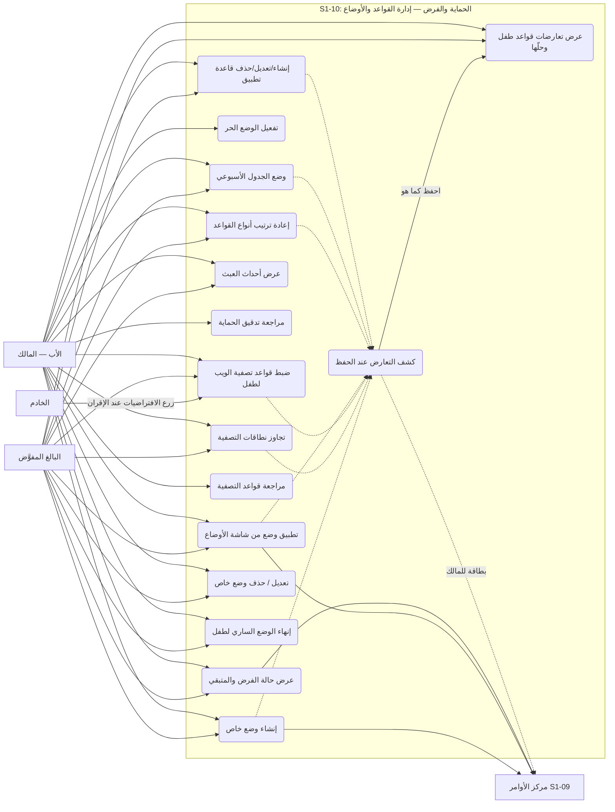
```mermaid
flowchart LR
    Father[الأب — المالك]
    Adult[البالغ المفوَّض]
    Server[الخادم]
    S109[مركز الأوامر S1-09]

    subgraph S110 [S1-10: الحماية والفرض — إدارة القواعد والأوضاع]
        direction TB
        UC1(إنشاء/تعديل/حذف قاعدة تطبيق)
        UC2(وضع الجدول الأسبوعي)
        UC3(إعادة ترتيب أنواع القواعد)
        UC4(تفعيل الوضع الحر)
        UC5(عرض حالة الفرض والمتبقي)
        UC11(تطبيق وضع من شاشة الأوضاع)
        UC12(عرض أحداث العبث)
        UC13(مراجعة تدقيق الحماية)
        UC14(ضبط قواعد تصفية الويب لطفل)
        UC15(تجاوز نطاقات التصفية)
        UC16(مراجعة قواعد التصفية)
        UC17(إنشاء وضع خاص)
        UC18(تعديل / حذف وضع خاص)
        UC19(إنهاء الوضع الساري لطفل)
        UC20(كشف التعارض عند الحفظ)
        UC21(عرض تعارضات قواعد طفل وحلّها)
    end

    Father --> UC1
    Father --> UC2
    Father --> UC3
    Father --> UC4
    Father --> UC5
    Father --> UC11
    Father --> UC12
    Father --> UC13
    Father --> UC14
    Father --> UC15
    Father --> UC16
    Father --> UC17
    Father --> UC18
    Father --> UC19
    Father --> UC21
    Adult --> UC1
    Adult --> UC2
    Adult --> UC3
    Adult --> UC5
    Adult --> UC11
    Adult --> UC12
    Adult --> UC14
    Adult --> UC15
    Adult --> UC17
    Adult --> UC18
    Adult --> UC19
    Adult --> UC21
    Server -->|زرع الافتراضيات عند الإقران| UC14
    UC1 -.-> UC20
    UC2 -.-> UC20
    UC3 -.-> UC20
    UC11 -.-> UC20
    UC14 -.-> UC20
    UC15 -.-> UC20
    UC17 -.-> UC20
    UC20 -->|احفظ كما هو| UC21
    UC20 -.->|بطاقة للمالك| S109
    UC5 --> S109
    UC11 --> S109
    UC17 --> S109
```

### 1-ب. استخدام الطفل والفرض (REQ-003/004/005/008/010/021/022/023)

يُقرأ منه: ما يفعله الأبناء ووحدة الفرض — فتح التطبيقات وطلب الوقت والعمل دون اتصال وكشف العبث.

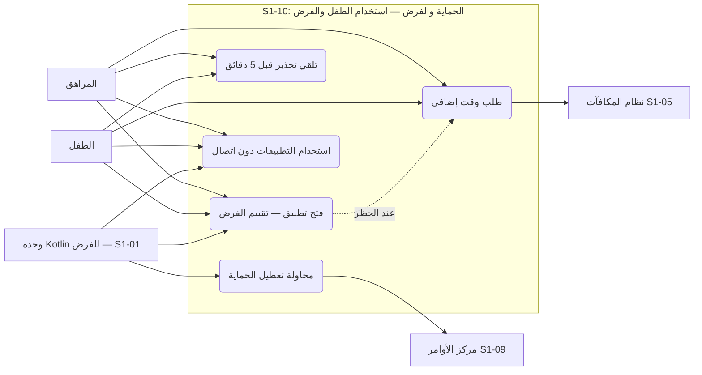
```mermaid
flowchart LR
    Teen[المراهق]
    Child[الطفل]
    Kotlin[وحدة Kotlin للفرض — S1-01]
    S105[نظام المكافآت S1-05]
    S109[مركز الأوامر S1-09]

    subgraph S110 [S1-10: الحماية والفرض — استخدام الطفل والفرض]
        direction TB
        UC6(فتح تطبيق — تقييم الفرض)
        UC7(طلب وقت إضافي)
        UC8(تلقي تحذير قبل 5 دقائق)
        UC9(محاولة تعطيل الحماية)
        UC10(استخدام التطبيقات دون اتصال)
    end

    Teen --> UC6
    Teen --> UC7
    Teen --> UC8
    Teen --> UC10
    Child --> UC6
    Child --> UC7
    Child --> UC8
    Child --> UC10
    Kotlin --> UC6
    Kotlin --> UC9
    Kotlin --> UC10
    UC6 -.->|عند الحظر| UC7
    UC7 --> S105
    UC9 --> S109
```

- ملاحظة: محاولة التعطيل (UC9) تُعرض أحداثها في UC12 (عرض أحداث العبث — اللوحة 1-أ)؛ والبطاقة الموحدة للتعارض (UC20) تُتضمَّن أيضاً من حفظ الحصة وتطبيقات الدراسة ضمناً مع UC1، ومن حفظ مهمة أو حدث (S1-06) ومنح الوقت (S1-05) — انظر 3-ل.

أُعيد رسمه 2026-11-17 (Q-405 · Q-406): أُضيفت UC17 (إنشاء وضع خاص) وUC18 (تعديل/حذف وضع خاص) وUC19 (إنهاء الوضع الساري لطفل)؛ وصارت UC11 «تطبيق وضع — جاهز أو خاص — من شاشة الأوضاع» ويدخلها البالغ المفوَّض بمفتاح تطبيق الأوضاع كما يدخل UC19؛ والعدد صار 19.

رُسم 2026-11-19 (Q-419 · Q-434): أُضيفت UC20 (كشف التعارض عند الحفظ) وUC21 (عرض تعارضات قواعد طفل وحلّها)؛ وقُسّم المخطط إلى لوحتين 1-أ/1-ب؛ وصارت الجهات الخارجية مستطيلات؛ واختصرت التسميات؛ والعدد صار 21.

- ملاحظة: حذف القاعدة (`protection.rule.delete`) وإعادة ترتيب الأنواع (`protection.priority.edit`) **قابلان للتفويض حسب القالب** (Q-146) — لذلك يظهر البالغ في UC1 وUC3. والوضع الحر (`protection.free_mode.activate`) **للمالك وحده** (Q-143) — لذلك لا يظهر البالغ في UC4. وزر SOS لا يظهر هنا لأنه ملك S1-01/S1-07 ولا يُحظر أبداً بأي قاعدة (Q-067).
- ملاحظة (Q-405 · Q-406): الأوضاع الخاصة — الإنشاء والتعديل والحذف (UC17/UC18) بمفاتيح قواعد التطبيقات الثلاثة (إنشاء/تعديل/حذف)، والتطبيق (UC11) والإنهاء (UC19) بمفتاح تطبيق الأوضاع (`protection.mode_preset.apply`) — بلا مفتاح جديد؛ والوضع الحر والأوضاع الجاهزة والخاصة من شاشة واحدة «الأوضاع» (S10-09 وS10-10 سطح واحد).
- قواعد تصفية الويب (UC14/UC15 — REQ-028/029/030 — Q-343): التحرير للمالك وحده (`protection.filter.edit`)، والعرض للأب + البالغ المفوَّض حسب القالب (`protection.filter.view`)؛ ومراجعة بلوغ 13 سنة واستبدال الجهاز (UC16 — REQ-027 — S10-14) للمالك.

## 2. مخطط قاعدة البيانات (ERD — §5)

يُقرأ منه: جداول النظام الاثنا عشر وعلاقاتها — اللوحة 2-أ للقواعد والحصة والحالة، واللوحة 2-ب للأوضاع والعبث والتصفية.

الجداول الاثنا عشر من §5 كما هي، مع أربعة مراجع خارجية: العائلة (S1-02)، والعضوية (S1-02)، والوقت الممنوح (S1-05)، و`AuditEvent` (النواة المشتركة). تسميات العلاقات موحدة: «يملك» للملكية، و«يُسجَّل في» للتدقيق، و«من فئة» لفئة القاعدة. وترتيب الحقول في كل جدول: الأساسي، ثم الأجنبية، ثم الحقول، ثم التواريخ. ولا جدول ولا حقل للتعارض (Q-419): وسم «متعارض» وصفحة التعارضات مشتقة من الجداول القائمة حتى يحكم المالك (س-1). ملاحظات: أحد عشر من الجداول الاثني عشر جداول عائلة تحمل `family_id` + عزل RLS (D-021)؛ والاستثناء الوحيد `web_category` — قاموس منصة ثابت بلا بيانات عائلة (لا `family_id` ولا RLS — Q-343). وحقول jsonb (`windows` و`order` و`remaining_by_app`) تُرسم `text` (مفردات ERD الموحدة Q-177 — النوع الحقيقي `jsonb` في §5) — كما في مخططات S1-05. وحقل `minutes_by_weekday` هو `int[7]` — الفهرس 0 = الأحد، 1 = الاثنين، 2 = الثلاثاء، 3 = الأربعاء، 4 = الخميس، 5 = الجمعة، 6 = السبت؛ وكل قيمة 0–1440. و`rule_priority.child_id` فارغ = ترتيب العائلة الافتراضي؛ وصف الطفل تجاوز اختياري عنه (REQ-011). و`enforcement_state` مرآة خادمية لحالة الجهاز — وتقييم الجهاز المحلي هو المرجع دون اتصال (REQ-025)؛ وتحمل `active_mode` (الوضع الساري: `study` أو `sleep` أو معرّف وضع خاص) و`active_mode_until`، و`active_rule_type` يأخذ القيمة `mode` حين يحسم وضع سارٍ (Q-405). و`app_rule.action` يقبل الفراغ: صف بلا إجراء يحمل علامة الدراسة `is_study_app` وحدها لتطبيق لا قاعدة له (REQ-007 · Q-405). و`mode_session.mode` نص: `study` أو `sleep` أو معرّف `custom_mode` — بلا مفتاح أجنبي إلى `custom_mode`. ومخازن العميل (مرآة Drift للقواعد والجدول والترتيب والقناع + Outbox) ليست جداول خادم — انظر §5. ولا علاقة مفاتيح بين `granted_time` وأي جدول هنا — الوقت الممنوح من S1-05 يدخل في "الإضافي" لصيغة المتبقي (REQ-002: المتبقي = الحصة + الإضافي − المستهلك) عبر محرك التقييم (DFD: S105→P4)؛ وحقل `remaining_by_app` في `enforcement_state` لقطة محسوبة للمتبقي لا علاقة تخزين.

### 2-أ. القواعد والجدول والترتيب والحصة والحالة (§5)

يُقرأ منه: جداول القواعد والحصة وحالة الفرض وعلاقاتها بالعائلة والعضوية والتدقيق.

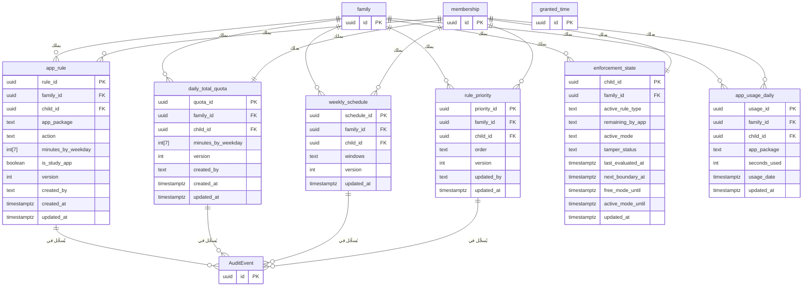
```mermaid
erDiagram
    family ||--o{ app_rule : "يملك"
    family ||--o{ daily_total_quota : "يملك"
    family ||--o{ weekly_schedule : "يملك"
    family ||--o{ rule_priority : "يملك"
    family ||--o{ enforcement_state : "يملك"
    family ||--o{ app_usage_daily : "يملك"
    membership ||--o{ app_rule : "يملك"
    membership ||--|| daily_total_quota : "يملك"
    membership ||--o{ weekly_schedule : "يملك"
    membership ||--o{ rule_priority : "يملك"
    membership ||--|| enforcement_state : "يملك"
    membership ||--o{ app_usage_daily : "يملك"
    app_rule ||--o{ AuditEvent : "يُسجَّل في"
    daily_total_quota ||--o{ AuditEvent : "يُسجَّل في"
    weekly_schedule ||--o{ AuditEvent : "يُسجَّل في"
    rule_priority ||--o{ AuditEvent : "يُسجَّل في"

    app_rule {
        uuid rule_id PK
        uuid family_id FK
        uuid child_id FK
        text app_package
        text action
        int[7] minutes_by_weekday
        boolean is_study_app
        int version
        text created_by
        timestamptz created_at
        timestamptz updated_at
    }
    daily_total_quota {
        uuid quota_id PK
        uuid family_id FK
        uuid child_id FK
        int[7] minutes_by_weekday
        int version
        text created_by
        timestamptz created_at
        timestamptz updated_at
    }
    weekly_schedule {
        uuid schedule_id PK
        uuid family_id FK
        uuid child_id FK
        text windows
        int version
        timestamptz updated_at
    }
    rule_priority {
        uuid priority_id PK
        uuid family_id FK
        uuid child_id FK
        text order
        int version
        text updated_by
        timestamptz updated_at
    }
    enforcement_state {
        uuid child_id PK
        uuid family_id FK
        text active_rule_type
        text remaining_by_app
        text active_mode
        text tamper_status
        timestamptz last_evaluated_at
        timestamptz next_boundary_at
        timestamptz free_mode_until
        timestamptz active_mode_until
        timestamptz updated_at
    }
    app_usage_daily {
        uuid usage_id PK
        uuid family_id FK
        uuid child_id FK
        text app_package
        int seconds_used
        timestamptz usage_date
        timestamptz updated_at
    }
    family {
        uuid id PK
    }
    membership {
        uuid id PK
    }
    granted_time {
        uuid id PK
    }
    AuditEvent {
        uuid id PK
    }
```

### 2-ب. الأوضاع والعبث والتصفية (§5)

يُقرأ منه: جداول الأوضاع الخاصة والوضع الحر والعبث وتصفية الويب وعلاقاتها.

```mermaid
erDiagram
    family ||--o{ free_mode_session : "يملك"
    family ||--o{ custom_mode : "يملك"
    family ||--o{ mode_session : "يملك"
    family ||--o{ tamper_event : "يملك"
    family ||--o{ web_filter_rule : "يملك"
    membership ||--o{ free_mode_session : "يملك"
    membership ||--o{ mode_session : "يملك"
    membership ||--o{ tamper_event : "يملك"
    membership ||--o{ web_filter_rule : "يملك"
    free_mode_session ||--o{ AuditEvent : "يُسجَّل في"
    custom_mode ||--o{ AuditEvent : "يُسجَّل في"
    mode_session ||--o{ AuditEvent : "يُسجَّل في"
    tamper_event ||--o{ AuditEvent : "يُسجَّل في"
    web_filter_rule ||--o{ AuditEvent : "يُسجَّل في"
    web_filter_rule }o--|| web_category : "من فئة"

    free_mode_session {
        uuid session_id PK
        uuid family_id FK
        uuid child_id FK
        text activated_by
        text status
        timestamptz activated_at
        timestamptz expires_at
        timestamptz cancelled_at
    }
    custom_mode {
        uuid mode_id PK
        uuid family_id FK
        text name
        text name_key
        text icon
        text opens
        text app_packages
        boolean keep_limits
        int version
        text created_by
        timestamptz created_at
        timestamptz updated_at
    }
    mode_session {
        uuid session_id PK
        uuid family_id FK
        uuid child_id FK
        text mode
        text activated_by
        boolean stops_at_window
        text status
        timestamptz activated_at
        timestamptz expires_at
        timestamptz ended_at
    }
    tamper_event {
        uuid event_id PK
        uuid family_id FK
        uuid child_id FK
        uuid device_id
        text kind
        boolean reactivation_attempted
        boolean notified
        timestamptz detected_at
        timestamptz resolved_at
    }
    web_category {
        int category_id PK
        text key
        text label_ar
    }
    web_filter_rule {
        uuid rule_id PK
        uuid family_id FK
        uuid child_id FK
        int category_id
        text action
        text settings
        int version
        text updated_by
        timestamptz updated_at
    }
    family {
        uuid id PK
    }
    membership {
        uuid id PK
    }
    AuditEvent {
        uuid id PK
    }
```

أُعيد رسمه 2026-11-17 (Q-405 · Q-406): أُضيف الكيانان `custom_mode` (تعريف وضع خاص على مستوى العائلة) و`mode_session` (جلسة وضع سارٍ لطفل) مع علاقاتهما والتدقيق؛ وأُضيف إلى `enforcement_state` حقلا `active_mode` و`active_mode_until`؛ و`app_rule.action` يقبل الفراغ لصف علامة الدراسة وحده؛ والعدد صار 12 جدولاً.

رُسم 2026-11-19 (Q-434): قُسّم المخطط إلى لوحتين 2-أ/2-ب؛ ووُحّدت تسميات العلاقات؛ وأُعيد ترتيب حقول الجداول الخمسة (التواريخ في الآخر).

- ملاحظة: `app_rule.action` يقبل الفراغ — صف بلا إجراء يحمل علامة الدراسة `is_study_app` وحدها لتطبيق لا قاعدة له (REQ-007 · Q-405).

## 3. التسلسل (Sequence) — من عقود §4 (REQ-001/002/003/004/005/006/008/009/010/011/012/013/014/015/016/017/018/019/020/021/022/023/024/026/027/028/029/030/031/032/033 — Q-419)

يُقرأ منه: تسلسل كل تدفق — من يحفظ القاعدة إلى من ينفذها على الجهاز — بترتيب مشاركين واحد: المستخدم، ثم التطبيق بمكوناته المحلية، ثم الخادم، ثم الخدمات الخارجية.

خمسة عشر مخططاً، كل واحد لتدفق واحد (3-ج و3-ك لوحتان لكل منهما؛ و3-ل و3-م جديدان لكشف التعارض Q-419):
- **عقد MQTT (Q-168 — الإحالة الصريحة إلى `docs/family-os/governance/architecture/MQTT-BROKER-SPEC.md`):** الوسيط Eclipse Mosquitto 2.x — عقدة واحدة في المرحلة 1 — TLS 1.2+ على المنفذ 8883 + mTLS (شهادة خادم + شهادة جهاز)؛ والأوامر (`family/{family_id}/devices/{device_id}/commands` / `family/{family_id}/protection/rules-updated` / `family/{family_id}/protection/free-mode`) QoS 1 + إقرار تطبيقي إلزامي؛ والعبث (`family/{family_id}/protection/tamper`) QoS 1؛ والحالة الدورية (`family/{family_id}/device/{device_id}/state`) QoS 0 + محفوظة؛ وبلا QoS 2 — التكرار يُغطيه `command_id`؛ وكل أمر يحمل `command_id` (idempotency)؛ والجلسة دائمة (clean session = false)؛ وlast will على `family/{family_id}/devices/{device_id}/status` = `offline`.
- **قنوات المنصة (§4-1 — `MethodChannel("familyos/enforcement")` و`EventChannel("familyos/enforcement/events")`):** الطرق الست الجديدة: `applySchedule(schedule: WeeklySchedule) -> void` (دفع الجدول الأسبوعي) · `applyPriority(order: List<RuleType>) -> void` (دفع ترتيب الأنواع) · `getEnforcementState() -> EnforcementState` (حالة الفرض للعرض) · `activateFreeMode(until: timestamp) -> void` (تفعيل الوضع الحر) · `evaluateNow() -> EnforcementDecision` (تقييم فوري عند فتح تطبيق) · `applyWebFilterRules(rules: WebFilterRules) -> void` (دفع قواعد تصفية الويب إلى VPN QProxy — REQ-028/029/030)؛ والأحداث: `enforcement_state` (موروثة) + `rule_blocked` و`tamper_detected` و`free_mode_changed`.

### 3-أ. إنشاء قاعدة تطبيق + دفع عبر MQTT (REQ-001/026 — §4-2 + §4-3)

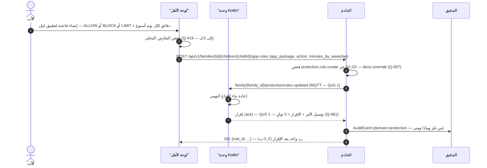
```mermaid
sequenceDiagram
    autonumber
    actor Father as الأب
    participant Flutter as "لوحة الأهل"
    participant K as "وحدة Kotlin"
    participant Ktor as الخادم
    participant Audit as التدقيق
    Father->>Flutter: إنشاء قاعدة لتطبيق ليان — ALLOW أو BLOCK أو LIMIT + دقائق لكل يوم أسبوع
    Flutter->>Flutter: فحص التعارض المحلي (Q-419 — إلى 3-ل)
    Flutter->>Ktor: POST /api/v1/families/{id}/children/{childId}/app-rules {app_package, action, minutes_by_weekday}
    Ktor->>Ktor: فحص protection.rule.create عبر S1-03 — deny-override (Q-007)
    Ktor->>K: family/{family_id}/protection/rules-updated (MQTT — QoS 1)
    K->>K: إعادة بناء القناع اليومي
    K-->>Ktor: إقرار (ack) — QoS 1 — توصيل الأمر + الإقرار < 5 ثوانٍ (Q-061)
    Ktor->>Audit: AuditEvent (domain=protection — من غيّر وماذا ومتى)
    Ktor-->>Flutter: 201 {rule_id, ...} — رد واحد بعد الإقرار (كـ 3-ب)
```

- قاعدة واحدة لكل (طفل، تطبيق) — قيد وحيد (REQ-001)؛ وكل دقيقة في `minutes_by_weekday` بين 0 و1440؛ والتطبيق بلا قاعدة = سماح، لا حظر ضمني؛ والرد `201` واحد بعد الإقرار — لا رد مبكر ولا تأكيد ثانٍ (نموذج 3-ب نفسه — و`POST .../app-rules` في §4-2 يعرّف `201` وحده).

### 3-ب. حفظ الجدول الأسبوعي مع كشف التعارض (REQ-006 — §4-2)

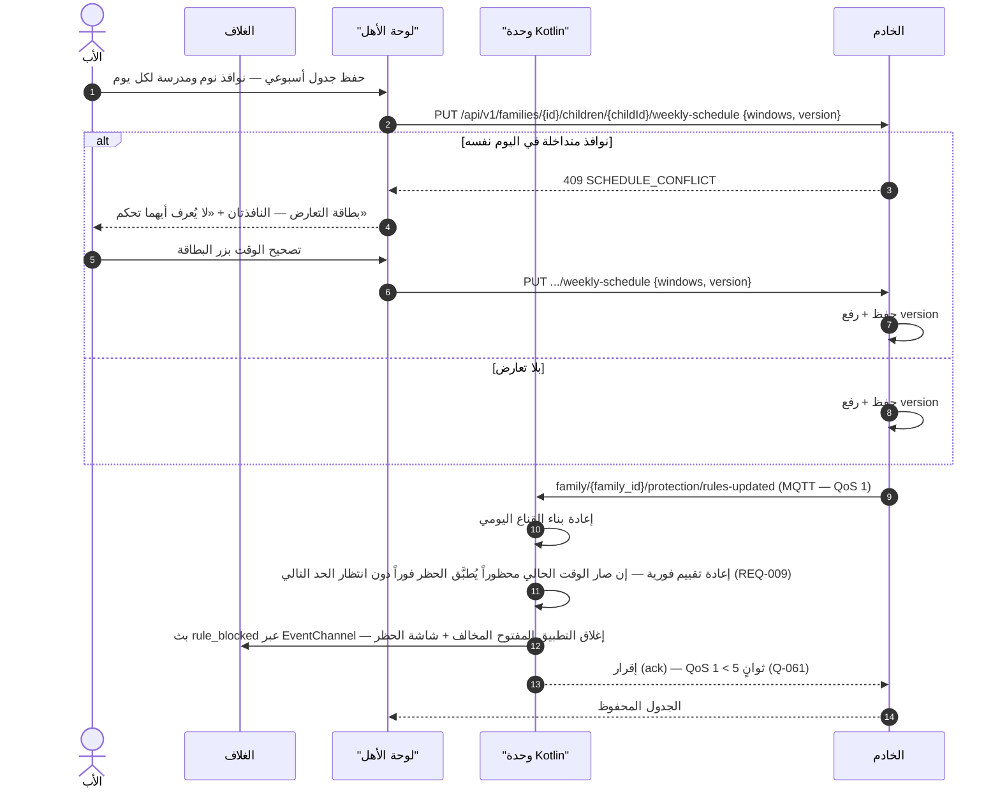
```mermaid
sequenceDiagram
    autonumber
    actor Father as الأب
    participant Shell as الغلاف
    participant Flutter as "لوحة الأهل"
    participant K as "وحدة Kotlin"
    participant Ktor as الخادم
    Father->>Flutter: حفظ جدول أسبوعي — نوافذ نوم ومدرسة لكل يوم
    Flutter->>Ktor: PUT /api/v1/families/{id}/children/{childId}/weekly-schedule {windows, version}
    alt نوافذ متداخلة في اليوم نفسه
        Ktor-->>Flutter: 409 SCHEDULE_CONFLICT
        Flutter-->>Father: بطاقة التعارض — النافذتان + «لا يُعرف أيهما تحكم»
        Father->>Flutter: تصحيح الوقت بزر البطاقة
        Flutter->>Ktor: PUT .../weekly-schedule {windows, version}
        Ktor->>Ktor: حفظ + رفع version
    else بلا تعارض
        Ktor->>Ktor: حفظ + رفع version
    end
    Ktor->>K: family/{family_id}/protection/rules-updated (MQTT — QoS 1)
    K->>K: إعادة بناء القناع اليومي
    K->>K: إعادة تقييم فورية — إن صار الوقت الحالي محظوراً يُطبَّق الحظر فوراً دون انتظار الحد التالي (REQ-009)
    K->>Shell: بث rule_blocked عبر EventChannel — إغلاق التطبيق المفتوح المخالف + شاشة الحظر
    K-->>Ktor: إقرار (ack) — QoS 1 < 5 ثوانٍ (Q-061)
    Ktor-->>Flutter: الجدول المحفوظ
```

- ملاحظة: تعديل متزامن من والد آخر على نسخة قديمة → `409 VERSION_CONFLICT` — يُعاد تحميل أحدث حالة قبل إعادة المحاولة (نمط S1-03 REQ-019 — قفل تفاؤلي على `version`). وكشف التعارض يشمل التداخل الليلي عبر منتصف الليل (REQ-006): نافذة `end_time <= start_time` تمتد إلى اليوم التالي. ونافذة تُحفظ فوق مهمة أو حدث موعده داخلها تُحذَّر ولا تُمنع (الحالة 4 — إلى 3-ل).

### 3-ج1. تقييم الفرض — الوضع الحر والوضع الساري (REQ-033 — الدرجتان الأولى والثانية — Q-405)

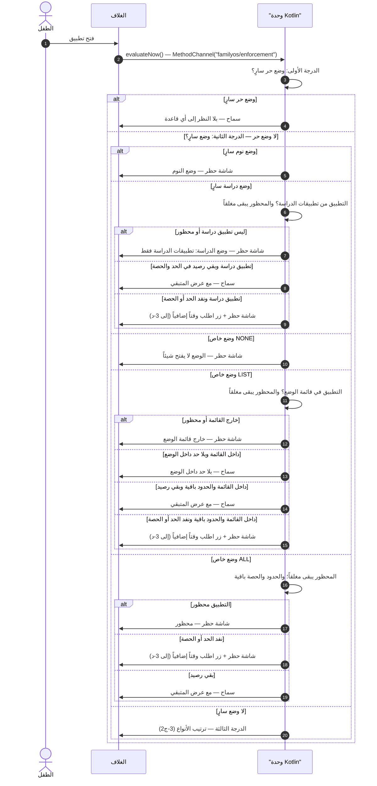
```mermaid
sequenceDiagram
    autonumber
    actor Child as الطفل
    participant Shell as الغلاف
    participant K as "وحدة Kotlin"
    Child->>Shell: فتح تطبيق
    Shell->>K: evaluateNow() — MethodChannel("familyos/enforcement")
    K->>K: الدرجة الأولى: وضع حر سارٍ؟
    alt وضع حر سارٍ
        K->>Shell: سماح — بلا النظر إلى أي قاعدة
    else لا وضع حر — الدرجة الثانية: وضع سارٍ؟
        alt وضع نوم سارٍ
            K->>Shell: شاشة حظر — وضع النوم
        else وضع دراسة سارٍ
            K->>K: التطبيق من تطبيقات الدراسة؟ والمحظور يبقى مغلقاً
            alt ليس تطبيق دراسة أو محظور
                K->>Shell: شاشة حظر — وضع الدراسة: تطبيقات الدراسة فقط
            else تطبيق دراسة وبقي رصيد في الحد والحصة
                K->>Shell: سماح — مع عرض المتبقي
            else تطبيق دراسة ونفد الحد أو الحصة
                K->>Shell: شاشة حظر + زر اطلب وقتاً إضافياً (إلى 3-د)
            end
        else وضع خاص NONE
            K->>Shell: شاشة حظر — الوضع لا يفتح شيئاً
        else وضع خاص LIST
            K->>K: التطبيق في قائمة الوضع؟ والمحظور يبقى مغلقاً
            alt خارج القائمة أو محظور
                K->>Shell: شاشة حظر — خارج قائمة الوضع
            else داخل القائمة وبلا حد داخل الوضع
                K->>Shell: سماح — بلا حد داخل الوضع
            else داخل القائمة والحدود باقية وبقي رصيد
                K->>Shell: سماح — مع عرض المتبقي
            else داخل القائمة والحدود باقية ونفد الحد أو الحصة
                K->>Shell: شاشة حظر + زر اطلب وقتاً إضافياً (إلى 3-د)
            end
        else وضع خاص ALL
            K->>K: المحظور يبقى مغلقاً؛ والحدود والحصة باقية
            alt التطبيق محظور
                K->>Shell: شاشة حظر — محظور
            else نفد الحد أو الحصة
                K->>Shell: شاشة حظر + زر اطلب وقتاً إضافياً (إلى 3-د)
            else بقي رصيد
                K->>Shell: سماح — مع عرض المتبقي
            end
        else لا وضع سارٍ
            K->>Shell: الدرجة الثالثة — ترتيب الأنواع (3-ج2)
        end
    end
```

### 3-ج2. تقييم الفرض — ترتيب أنواع القواعد (REQ-008/010/011/012 — الدرجة الثالثة — Q-145)

تتمة 3-ج1 حين لا يكون وضع سارٍ.

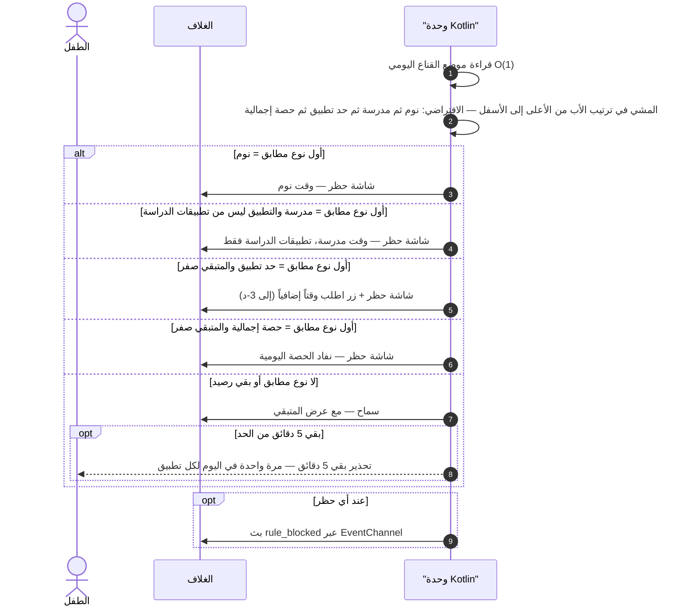
```mermaid
sequenceDiagram
    autonumber
    actor Child as الطفل
    participant Shell as الغلاف
    participant K as "وحدة Kotlin"
    K->>K: قراءة موضع القناع اليومي O(1)
    K->>K: المشي في ترتيب الأب من الأعلى إلى الأسفل — الافتراضي: نوم ثم مدرسة ثم حد تطبيق ثم حصة إجمالية
    alt أول نوع مطابق = نوم
        K->>Shell: شاشة حظر — وقت نوم
    else أول نوع مطابق = مدرسة والتطبيق ليس من تطبيقات الدراسة
        K->>Shell: شاشة حظر — وقت مدرسة، تطبيقات الدراسة فقط
    else أول نوع مطابق = حد تطبيق والمتبقي صفر
        K->>Shell: شاشة حظر + زر اطلب وقتاً إضافياً (إلى 3-د)
    else أول نوع مطابق = حصة إجمالية والمتبقي صفر
        K->>Shell: شاشة حظر — نفاد الحصة اليومية
    else لا نوع مطابق أو بقي رصيد
        K->>Shell: سماح — مع عرض المتبقي
        opt بقي 5 دقائق من الحد
            K-->>Child: تحذير بقي 5 دقائق — مرة واحدة في اليوم لكل تطبيق
        end
    end
    opt عند أي حظر
        K->>Shell: بث rule_blocked عبر EventChannel
    end
```

أُعيد رسمه 2026-11-17 (Q-405): التقييم صار سلّم REQ-033 بثلاث درجات — حر، ثم وضع سارٍ (جاهز أو خاص)، ثم ترتيب أنواع القواعد؛ والمحظور يبقى مغلقاً في كل وضع عدا الحر؛ ووضع `ALL` يبقي الحدود والحصة والمحظور؛ ووضع الدراسة يفتح تطبيقات الدراسة وحدها مع بقاء الحد والحصة.

قُسّم 2026-11-19 (Q-434) إلى لوحتين 3-ج1/3-ج2؛ وحُوّلت الملاحظتان إلى opt؛ وحُذفت أرقام المتطلبات من الرسائل إلى العناوين.

- ملاحظة (تعارض في المواصفة — يُبلَّغ ولا يُحسم): نص `evaluateNow` في SPEC §4-1 ما زال يصف الفحصين القديمين (وضع حر ثم ترتيب الأنواع) ولم يُحدَّث بدرجة الوضع الساري؛ والسلّم هنا من REQ-033 (§3). وكذلك `getEnforcementState` في §4-1 ما زال يرجع الحقول القديمة بلا `active_mode`.

- صيغة المتبقي عند التقييم (REQ-002): المتبقي = الحصة + الإضافي − المستهلك؛ والحصة من `daily_total_quota`، والإضافي من S1-05، والمستهلك من `app_usage_daily`.
- الترتيب الافتراضي يعمل بلا إعداد؛ والأب يعيد ترتيب الأنواع لكل عائلة ولكل طفل (REQ-011)؛ والوقت المكتسب أو الممنوح يضيف دقائق إلى حد التطبيق فقط — ولا يفتح تطبيقاً في وقت نوم أو مدرسة (REQ-012). وزر SOS لا يُحظر أبداً (Q-067) — خارج هذا التدفق.

### 3-د. نفاد الحد — شاشة الحظر وطلب وقت (REQ-003/004/005 + S1-05)

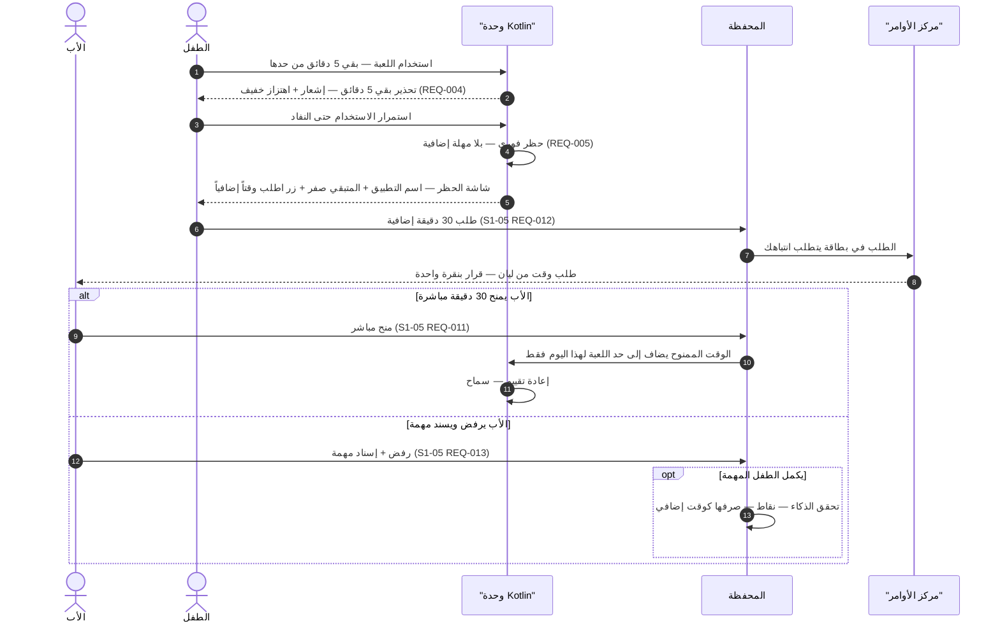
```mermaid
sequenceDiagram
    autonumber
    actor Father as الأب
    actor Child as الطفل
    participant K as "وحدة Kotlin"
    participant S105 as المحفظة
    participant S109 as "مركز الأوامر"
    Child->>K: استخدام اللعبة — بقي 5 دقائق من حدها
    K-->>Child: تحذير بقي 5 دقائق — إشعار + اهتزاز خفيف (REQ-004)
    Child->>K: استمرار الاستخدام حتى النفاد
    K->>K: حظر فوري — بلا مهلة إضافية (REQ-005)
    K-->>Child: شاشة الحظر — اسم التطبيق + المتبقي صفر + زر اطلب وقتاً إضافياً
    Child->>S105: طلب 30 دقيقة إضافية (S1-05 REQ-012)
    S105->>S109: الطلب في بطاقة يتطلب انتباهك
    S109-->>Father: طلب وقت من ليان — قرار بنقرة واحدة
    alt الأب يمنح 30 دقيقة مباشرة
        Father->>S105: منح مباشر (S1-05 REQ-011)
        S105->>K: الوقت الممنوح يضاف إلى حد اللعبة لهذا اليوم فقط
        K->>K: إعادة تقييم — سماح
    else الأب يرفض ويسند مهمة
        Father->>S105: رفض + إسناد مهمة (S1-05 REQ-013)
        opt يكمل الطفل المهمة
            S105->>S105: تحقق الذكاء — نقاط — صرفها كوقت إضافي
        end
    end
```

### 3-هـ. الوضع الحر — تفعيل وانتهاء (REQ-018/019/020 — Q-143)

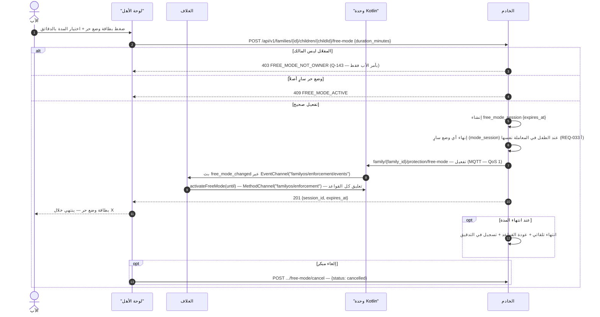
```mermaid
sequenceDiagram
    autonumber
    actor Father as الأب
    participant Flutter as "لوحة الأهل"
    participant Shell as الغلاف
    participant K as "وحدة Kotlin"
    participant Ktor as الخادم
    Father->>Flutter: ضغط بطاقة وضع حر + اختيار المدة بالدقائق
    Flutter->>Ktor: POST /api/v1/families/{id}/children/{childId}/free-mode {duration_minutes}
    alt المفعّل ليس المالك
        Ktor-->>Flutter: 403 FREE_MODE_NOT_OWNER (Q-143 — بأمر الأب فقط)
    else وضع حر سارٍ أصلاً
        Ktor-->>Flutter: 409 FREE_MODE_ACTIVE
    else تفعيل صحيح
        Ktor->>Ktor: إنشاء free_mode_session {expires_at}
        Ktor->>Ktor: إنهاء أي وضع سارٍ (mode_session) عند الطفل في المعاملة نفسها (REQ-033 أ)
        Ktor->>K: family/{family_id}/protection/free-mode — تفعيل (MQTT — QoS 1)
        K->>Shell: بث free_mode_changed عبر EventChannel("familyos/enforcement/events")
        Shell->>K: activateFreeMode(until) — MethodChannel("familyos/enforcement") — تعليق كل القواعد
        Ktor-->>Flutter: 201 {session_id, expires_at}
        Flutter-->>Father: بطاقة وضع حر — ينتهي خلال X
        opt عند انتهاء المدة
            Ktor->>Ktor: انتهاء تلقائي + عودة القواعد + تسجيل في التدقيق
        end
        opt إلغاء مبكر
            Flutter->>Ktor: POST .../free-mode/cancel — {status: cancelled}
        end
    end
```

- أثناء الوضع الحر: زر SOS يعمل كالعادة؛ والاستخدام يُحسب في التقارير ولا يُحدَّد؛ والوضع الحر لا يمسح تنبيهات العبث المعلقة ولا يوقف محاولات إعادة التفعيل (REQ-020). ونموذج الرد هنا يختلف عن 3-أ/3-ب قصداً: الجلسة تُنشأ خادمياً فيُرجع `201` فور إرسال أمر التفعيل عبر MQTT — لأن `201` هنا يثبت إنشاء الجلسة لا سريانها على الجهاز؛ وإقرار الجهاز يصل لاحقاً عبر موضوع الإقرارات `devices/{device_id}/acks` (§4-3) — فلا ينتظر الأب الإقرار ليرى البطاقة. والجلسة منتهية متى بلغ الوقت `expires_at` ولو بقي `status` مخزَّناً ACTIVE — والخادم يصحّح `status` إلى EXPIRED كسولاً عند أول قراءة/تفعيل/مزامنة لاحقة (بلا وظيفة مسح)، وحدث التدقيق يحمل `expires_at` (REQ-019).

### 3-و. كشف العبث — تنبيه + إعادة تفعيل (REQ-021/022/023 — Q-144)

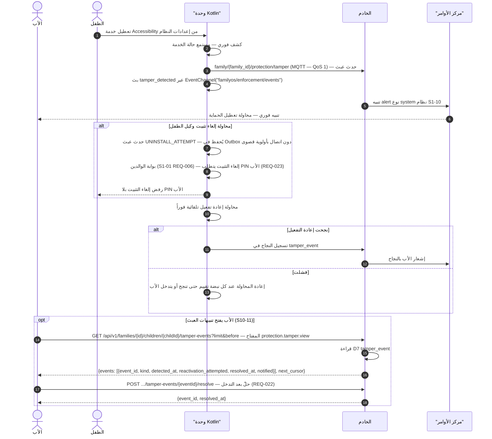
```mermaid
sequenceDiagram
    autonumber
    actor Father as الأب
    actor Child as الطفل
    participant K as "وحدة Kotlin"
    participant Ktor as الخادم
    participant S109 as "مركز الأوامر"
    Child->>K: تعطيل خدمة Accessibility من إعدادات النظام
    K->>K: كشف فوري — مستمع حالة الخدمة
    K->>Ktor: family/{family_id}/protection/tamper (MQTT — QoS 1) — حدث عبث
    K->>K: بث tamper_detected عبر EventChannel("familyos/enforcement/events")
    Ktor->>S109: تنبيه alert نوع system نظام S1-10
    S109-->>Father: تنبيه فوري — محاولة تعطيل الحماية
    alt محاولة إلغاء تثبيت وكيل الطفل
        K->>K: حدث عبث UNINSTALL_ATTEMPT — يُحفظ في Outbox دون اتصال بأولوية قصوى
        K->>K: بوابة الوالدين (S1-01 REQ-006) — إلغاء التثبيت يتطلب PIN الأب (REQ-023)
        K-->>Child: رفض إلغاء التثبيت بلا PIN الأب
    end
    K->>K: محاولة إعادة تفعيل تلقائية فوراً
    alt نجحت إعادة التفعيل
        K->>Ktor: تسجيل النجاح في tamper_event
        Ktor->>S109: إشعار الأب بالنجاح
    else فشلت
        K->>K: إعادة المحاولة عند كل نبضة تقييم حتى تنجح أو يتدخل الأب
    end
    opt الأب يفتح تنبيهات العبث (S10-11)
        Father->>Ktor: GET /api/v1/families/{id}/children/{childId}/tamper-events?limit&before — المفتاح protection.tamper.view
        Ktor->>Ktor: قراءة D7 tamper_event
        Ktor-->>Father: {events: [{event_id, kind, detected_at, reactivation_attempted, resolved_at, notified}], next_cursor}
        Father->>Ktor: POST .../tamper-events/{eventId}/resolve — حلّ بعد التدخل (REQ-022)
        Ktor-->>Father: {event_id, resolved_at}
    end
```

- أنواع العبث: `UNINSTALL_ATTEMPT` · `ACCESSIBILITY_DISABLED` · `DEVICE_ADMIN_REVOKED` · `VPN_DISCONNECTED` · `SERVICE_KILLED` (REQ-021). ودون اتصال يُحفظ حدث العبث في Outbox بأولوية قصوى. وإلغاء تثبيت وكيل الطفل يتطلب PIN الأب (REQ-023 — Q-065 · Q-142 — نمط Bark Kids: رمز يصدره الأب). والتنبيه يبقى ظاهراً للأب ولا يُسكَت من جهاز الطفل (REQ-022).

### 3-ز. مزامنة دون اتصال (REQ-014/015/016/017 — Q-064)

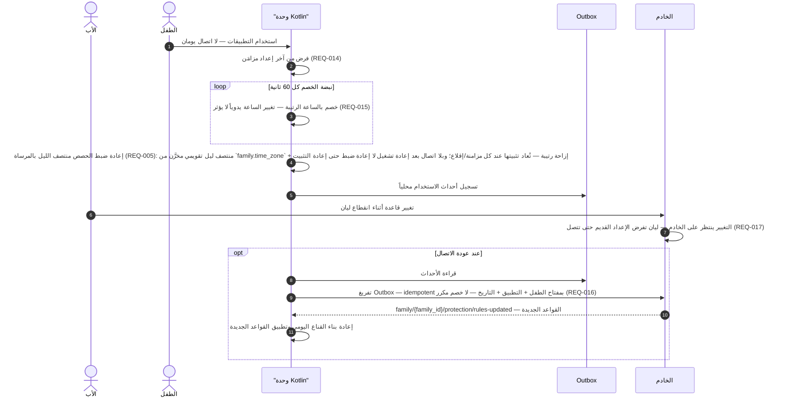
```mermaid
sequenceDiagram
    autonumber
    actor Father as الأب
    actor Child as الطفل
    participant K as "وحدة Kotlin"
    participant OB as Outbox
    participant Ktor as الخادم
    Child->>K: استخدام التطبيقات — لا اتصال يومان
    K->>K: فرض من آخر إعداد مزامَن (REQ-014)
    loop نبضة الخصم كل 60 ثانية
        K->>K: خصم بالساعة الرتيبة — تغيير الساعة يدوياً لا يؤثر (REQ-015)
    end
    K->>K: إعادة ضبط الحصص منتصف الليل بالمرساة (REQ-005): منتصف ليل تقويمي مخزَّن من `family.time_zone` + إزاحة رتيبة — تُعاد تثبيتها عند كل مزامنة/إقلاع؛ وبلا اتصال بعد إعادة تشغيل لا إعادة ضبط حتى إعادة التثبيت
    K->>OB: تسجيل أحداث الاستخدام محلياً
    Father->>Ktor: تغيير قاعدة أثناء انقطاع ليان
    Ktor->>Ktor: التغيير ينتظر على الخادم — ليان تفرض الإعداد القديم حتى تتصل (REQ-017)
    opt عند عودة الاتصال
        K->>OB: قراءة الأحداث
        K->>Ktor: تفريغ Outbox — idempotent بمفتاح الطفل + التطبيق + التاريخ — لا خصم مكرر (REQ-016)
        Ktor-->>K: family/{family_id}/protection/rules-updated — القواعد الجديدة
        K->>K: إعادة بناء القناع اليومي وتطبيق القواعد الجديدة
    end
```

### 3-ح. دورة الأمر والإقرار عبر MQTT (REQ-001/026 — §4-3 + Q-168)

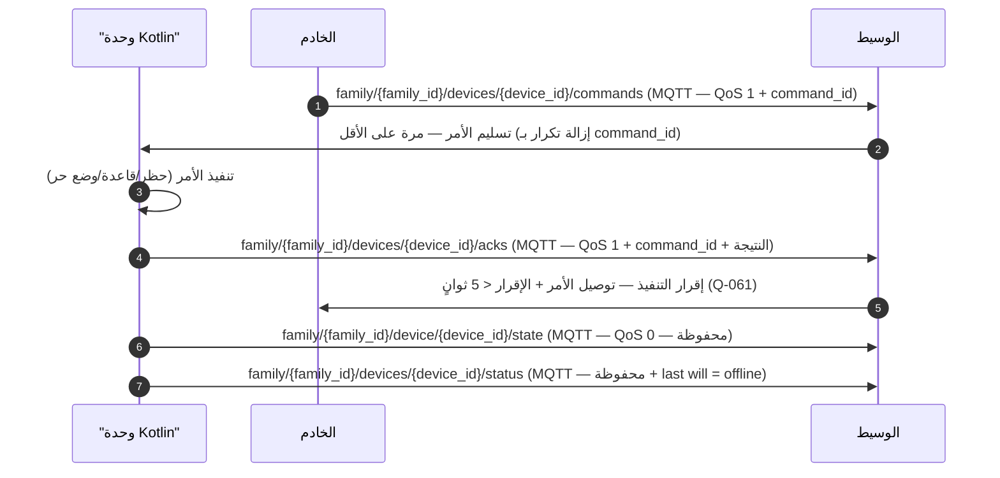
```mermaid
sequenceDiagram
    autonumber
    participant K as "وحدة Kotlin"
    participant Ktor as الخادم
    participant Mosquitto as الوسيط
    Ktor->>Mosquitto: family/{family_id}/devices/{device_id}/commands (MQTT — QoS 1 + command_id)
    Mosquitto->>K: تسليم الأمر — مرة على الأقل (إزالة تكرار بـ command_id)
    K->>K: تنفيذ الأمر (حظر/قاعدة/وضع حر)
    K->>Mosquitto: family/{family_id}/devices/{device_id}/acks (MQTT — QoS 1 + command_id + النتيجة)
    Mosquitto->>Ktor: إقرار التنفيذ — توصيل الأمر + الإقرار < 5 ثوانٍ (Q-061)
    K->>Mosquitto: family/{family_id}/device/{device_id}/state (MQTT — QoS 0 — محفوظة)
    K->>Mosquitto: family/{family_id}/devices/{device_id}/status (MQTT — محفوظة + last will = offline)
```

- الوسيط Eclipse Mosquitto 2.x — TLS 1.2+ على 8883 + mTLS (Q-168).

### 3-ط. تطبيق وضع — جاهز أو خاص (REQ-024/032/033 — §4-2 POST .../mode-presets/{preset} · Q-405)

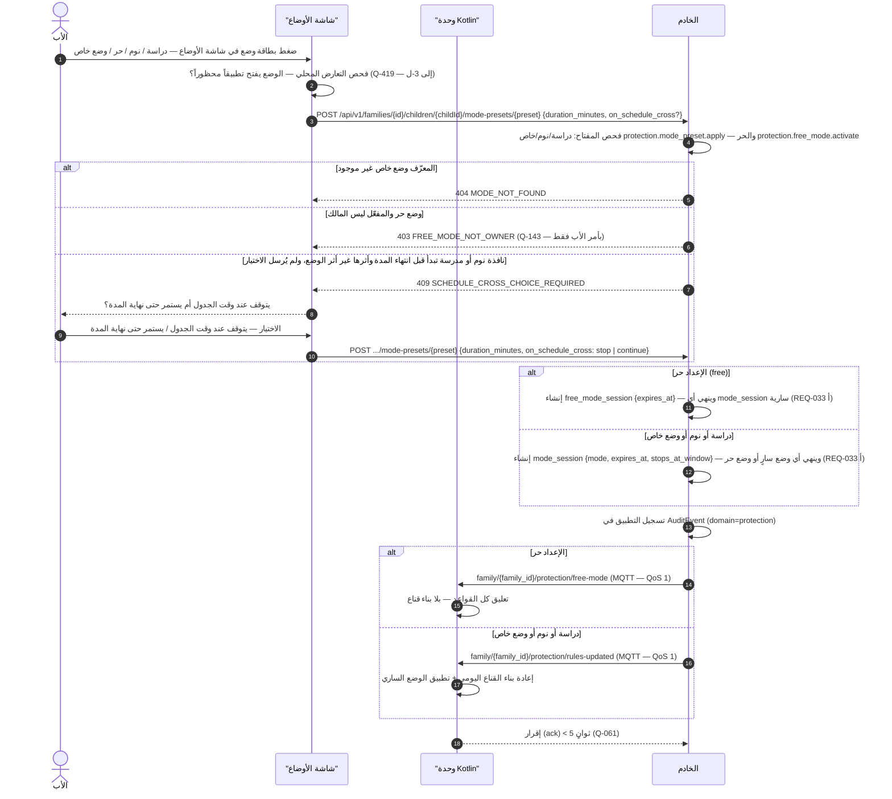
```mermaid
sequenceDiagram
    autonumber
    actor Father as الأب
    participant S110 as "شاشة الأوضاع"
    participant K as "وحدة Kotlin"
    participant Ktor as الخادم
    Father->>S110: ضغط بطاقة وضع في شاشة الأوضاع — دراسة / نوم / حر / وضع خاص
    S110->>S110: فحص التعارض المحلي — الوضع يفتح تطبيقاً محظوراً؟ (Q-419 — إلى 3-ل)
    S110->>Ktor: POST /api/v1/families/{id}/children/{childId}/mode-presets/{preset} {duration_minutes, on_schedule_cross?}
    Ktor->>Ktor: فحص المفتاح: دراسة/نوم/خاص protection.mode_preset.apply — والحر protection.free_mode.activate
    alt المعرّف وضع خاص غير موجود
        Ktor-->>S110: 404 MODE_NOT_FOUND
    else وضع حر والمفعّل ليس المالك
        Ktor-->>S110: 403 FREE_MODE_NOT_OWNER (Q-143 — بأمر الأب فقط)
    else نافذة نوم أو مدرسة تبدأ قبل انتهاء المدة وأثرها غير أثر الوضع، ولم يُرسل الاختيار
        Ktor-->>S110: 409 SCHEDULE_CROSS_CHOICE_REQUIRED
        S110-->>Father: يتوقف عند وقت الجدول أم يستمر حتى نهاية المدة؟
        Father->>S110: الاختيار — يتوقف عند وقت الجدول / يستمر حتى نهاية المدة
        S110->>Ktor: POST .../mode-presets/{preset} {duration_minutes, on_schedule_cross: stop | continue}
    end
    alt الإعداد حر (free)
        Ktor->>Ktor: إنشاء free_mode_session {expires_at} — وينهي أي mode_session سارية (REQ-033 أ)
    else دراسة أو نوم أو وضع خاص
        Ktor->>Ktor: إنشاء mode_session {mode, expires_at, stops_at_window} — وينهي أي وضع سارٍ أو وضع حر (REQ-033 أ)
    end
    Ktor->>Ktor: تسجيل التطبيق في AuditEvent (domain=protection)
    alt الإعداد حر
        Ktor->>K: family/{family_id}/protection/free-mode (MQTT — QoS 1)
        K->>K: تعليق كل القواعد — بلا بناء قناع
    else دراسة أو نوم أو وضع خاص
        Ktor->>K: family/{family_id}/protection/rules-updated (MQTT — QoS 1)
        K->>K: إعادة بناء القناع اليومي + تطبيق الوضع الساري
    end
    K-->>Ktor: إقرار (ack) < 5 ثوانٍ (Q-061)
```

أُعيد رسمه 2026-11-17 (Q-405): `{preset}` يقبل `study` أو `sleep` أو `free` أو معرّف وضع خاص؛ والمدة مطلوبة لكل وضع؛ والتقاطع مع نافذة جدول أثرها غير أثر الوضع يُرجع `409 SCHEDULE_CROSS_CHOICE_REQUIRED` حتى يختار الأب؛ والتطبيق ينهي أي وضع سارٍ أو وضع حر في المعاملة نفسها (وضع واحد لكل طفل)؛ ومعرّف خاص غير موجود يُرجع `404 MODE_NOT_FOUND`.

رُسم 2026-11-19 (Q-434): المشارك «مركز الأوامر» صار «شاشة الأوضاع» (S110)؛ وأُضيف فحص التعارض المحلي قبل POST.

- المعاينة قبل التطبيق (S10-10) تذكر أثر الوضع على كل طفل باسمه وتقول إن الجديد ينهي الساري (REQ-033 أ/هـ)؛ وبلا مدة لا تطبيق (Q-087).

### 3-ي. حفظ قواعد تصفية الويب + دفع إلى VPN QProxy (REQ-028/029/030/031 — Q-343)

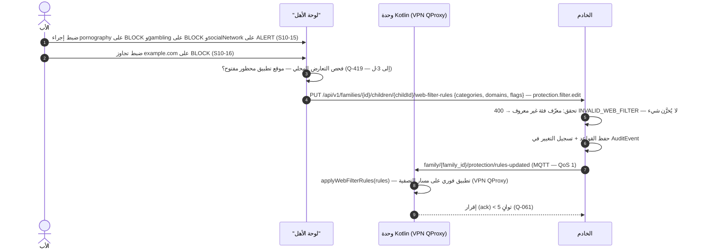
```mermaid
sequenceDiagram
    autonumber
    actor Father as الأب
    participant Flutter as "لوحة الأهل"
    participant K as وحدة Kotlin (VPN QProxy)
    participant Ktor as الخادم
    Father->>Flutter: ضبط إجراء pornography على BLOCK وgambling على BLOCK وsocialNetwork على ALERT (S10-15)
    Father->>Flutter: ضبط تجاوز example.com على BLOCK (S10-16)
    Flutter->>Flutter: فحص التعارض المحلي — موقع تطبيق محظور مفتوح؟ (Q-419 — إلى 3-ل)
    Flutter->>Ktor: PUT /api/v1/families/{id}/children/{childId}/web-filter-rules {categories, domains, flags} — protection.filter.edit
    Ktor->>Ktor: تحقق: معرّف فئة غير معروف → 400 INVALID_WEB_FILTER — لا يُخزَّن شيء
    Ktor->>Ktor: حفظ القواعد + تسجيل التغيير في AuditEvent
    Ktor->>K: family/{family_id}/protection/rules-updated (MQTT — QoS 1)
    K->>K: applyWebFilterRules(rules) — تطبيق فوري على مسار التصفية (VPN QProxy)
    K-->>Ktor: إقرار (ack) < 5 ثوانٍ (Q-061)
```

- تجاوز النطاق يفوز على إجراء الفئة (REQ-029)؛ والطفل المقترن حديثاً تُزرع قواعده بالافتراضيات قبل أي إجراء من الأب (REQ-031). والفئات العشر المحظورة من أول يوم (Q-405): 14 إباحية · 12 محتوى ناضج · 7 قمار · 3 مخدرات · 1 كحول · 21 تبغ · 23 عنف · 24 أسلحة · 15 ألفاظ بذيئة · 29 بروكسي/ثغرات؛ والعشرون الباقية `ALLOW`؛ وكلها قابلة لتعديل الأب. والإجراء `IGNORE` (3) لا يُعرض في المرحلة 1 والخادم يرفضه `INVALID_RULE`؛ والمعروض: سماح، حظر، تنبيه (REQ-029 · Q-405).
[تصحيح 2026-11-08 (Q-343 — Q343-01): معرّف الشاشة S10-16 (تجاوزات نطاقات التصفية — REQ-029) كان غائباً من هذا الملف رغم أن مضمونه كان موجوداً: تسلسل 3-ي يحمل `domains` في حمولة PUT، والملاحظة أعلاه تستشهد بـ REQ-029 «تجاوز النطاق يفوز على إجراء الفئة»؛ أُضيف المعرف في تسلسل 3-ي وعقدة FWeb في §4 بنمط S10-15 نفسه، بلا تغيير في عدد التغطية (REQ-029 مغطى بـ S10-16 أصلاً في SPEC :903).]

رُسم 2026-11-19 (Q-434): المشارك «التطبيق» صار «لوحة الأهل»؛ وأُضيف فحص التعارض المحلي قبل PUT.

### 3-ك1. إدارة الأوضاع الخاصة — إنشاء وتعديل (REQ-032/033 — §4-2 · Q-405)

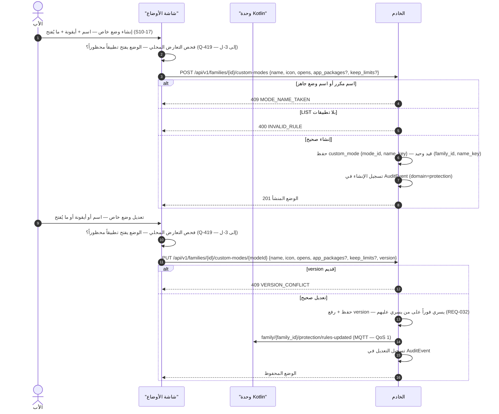
```mermaid
sequenceDiagram
    autonumber
    actor Father as الأب
    participant S110 as "شاشة الأوضاع"
    participant K as "وحدة Kotlin"
    participant Ktor as الخادم
    Father->>S110: إنشاء وضع خاص — اسم + أيقونة + ما يُفتح (S10-17)
    S110->>S110: فحص التعارض المحلي — الوضع يفتح تطبيقاً محظوراً؟ (Q-419 — إلى 3-ل)
    S110->>Ktor: POST /api/v1/families/{id}/custom-modes {name, icon, opens, app_packages?, keep_limits?}
    alt اسم مكرر أو اسم وضع جاهز
        Ktor-->>S110: 409 MODE_NAME_TAKEN
    else LIST بلا تطبيقات
        Ktor-->>S110: 400 INVALID_RULE
    else إنشاء صحيح
        Ktor->>Ktor: حفظ custom_mode {mode_id, name_key} — قيد وحيد (family_id, name_key)
        Ktor->>Ktor: تسجيل الإنشاء في AuditEvent (domain=protection)
        Ktor-->>S110: 201 الوضع المنشأ
    end
    Father->>S110: تعديل وضع خاص — اسم أو أيقونة أو ما يُفتح
    S110->>S110: فحص التعارض المحلي — الوضع يفتح تطبيقاً محظوراً؟ (Q-419 — إلى 3-ل)
    S110->>Ktor: PUT /api/v1/families/{id}/custom-modes/{modeId} {name, icon, opens, app_packages?, keep_limits?, version}
    alt version قديم
        Ktor-->>S110: 409 VERSION_CONFLICT
    else تعديل صحيح
        Ktor->>Ktor: حفظ + رفع version — يسري فوراً على من يسري عليهم (REQ-032)
        Ktor->>K: family/{family_id}/protection/rules-updated (MQTT — QoS 1)
        Ktor->>Ktor: تسجيل التعديل في AuditEvent
        Ktor-->>S110: الوضع المحفوظ
    end
```

### 3-ك2. إدارة الأوضاع الخاصة — حذف وإنهاء الوضع الساري (REQ-032/033 — §4-2 · Q-405)

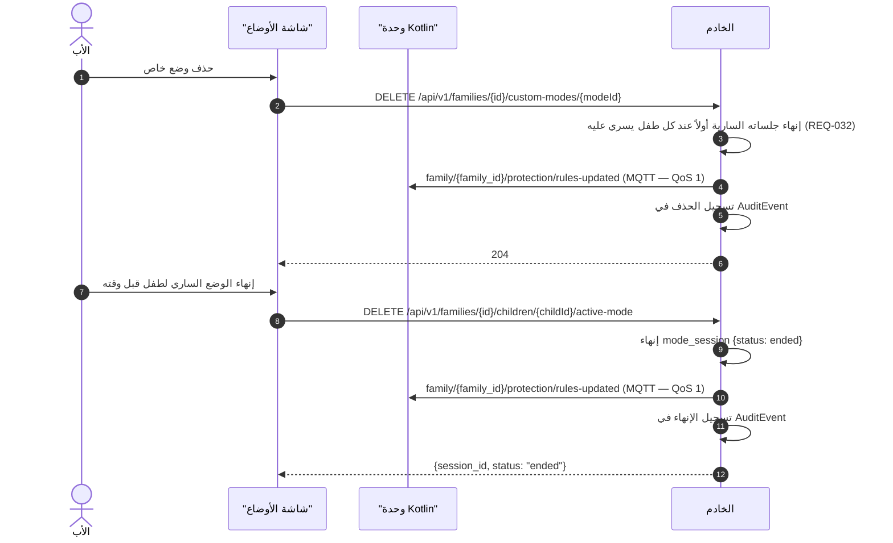
```mermaid
sequenceDiagram
    autonumber
    actor Father as الأب
    participant S110 as "شاشة الأوضاع"
    participant K as "وحدة Kotlin"
    participant Ktor as الخادم
    Father->>S110: حذف وضع خاص
    S110->>Ktor: DELETE /api/v1/families/{id}/custom-modes/{modeId}
    Ktor->>Ktor: إنهاء جلساته السارية أولاً عند كل طفل يسري عليه (REQ-032)
    Ktor->>K: family/{family_id}/protection/rules-updated (MQTT — QoS 1)
    Ktor->>Ktor: تسجيل الحذف في AuditEvent
    Ktor-->>S110: 204
    Father->>S110: إنهاء الوضع الساري لطفل قبل وقته
    S110->>Ktor: DELETE /api/v1/families/{id}/children/{childId}/active-mode
    Ktor->>Ktor: إنهاء mode_session {status: ended}
    Ktor->>K: family/{family_id}/protection/rules-updated (MQTT — QoS 1)
    Ktor->>Ktor: تسجيل الإنهاء في AuditEvent
    Ktor-->>S110: {session_id, status: "ended"}
```

قُسّم 2026-11-19 (Q-434) إلى لوحتين 3-ك1/3-ك2؛ وأُضيف فحص التعارض المحلي قبل الإنشاء والتعديل.

رُسم 2026-11-17 (Q-405): مخطط جديد — نقاط الأوضاع الخاصة الخمس: الإنشاء بمفتاح `protection.rule.create`، والتعديل بمفتاح `protection.rule.edit`، والحذف بمفتاح `protection.rule.delete`، والإنهاء بمفتاح `protection.mode_preset.apply`؛ وتعديل وضع سارٍ يسري فوراً؛ وحذفه ينهي جلساته أولاً.

### 3-ل. كشف التعارض عند الحفظ — لا تعارض صامت (REQ-006/013/029/033 — §9.8 (و) — Q-419)

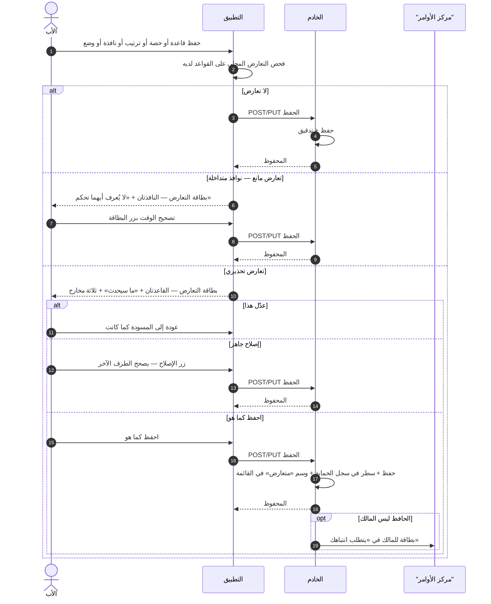
```mermaid
sequenceDiagram
    autonumber
    actor Father as الأب
    participant App as التطبيق
    participant Ktor as الخادم
    participant S109 as "مركز الأوامر"
    Father->>App: حفظ قاعدة أو حصة أو ترتيب أو نافذة أو وضع
    App->>App: فحص التعارض المحلي على القواعد لديه
    alt لا تعارض
        App->>Ktor: POST/PUT الحفظ
        Ktor->>Ktor: حفظ + تدقيق
        Ktor-->>App: المحفوظ
    else تعارض مانع — نوافذ متداخلة
        App-->>Father: بطاقة التعارض — النافذتان + «لا يُعرف أيهما تحكم»
        Father->>App: تصحيح الوقت بزر البطاقة
        App->>Ktor: POST/PUT الحفظ
        Ktor-->>App: المحفوظ
    else تعارض تحذيري
        App-->>Father: بطاقة التعارض — القاعدتان + «ما سيحدث» + ثلاثة مخارج
        alt عدّل هذا
            Father->>App: عودة إلى المسودة كما كانت
        else إصلاح جاهز
            Father->>App: زر الإصلاح — يصحح الطرف الآخر
            App->>Ktor: POST/PUT الحفظ
            Ktor-->>App: المحفوظ
        else احفظ كما هو
            Father->>App: احفظ كما هو
            App->>Ktor: POST/PUT الحفظ
            Ktor->>Ktor: حفظ + سطر في سجل الحماية + وسم «متعارض» في القائمة
            Ktor-->>App: المحفوظ
            opt الحافظ ليس المالك
                Ktor->>S109: بطاقة للمالك في «يتطلب انتباهك»
            end
        end
    end
```

رُسم 2026-11-19 (Q-419 · Q-434): مخطط جديد — الفحص محلي في التطبيق قبل كل حفظ من الحفظات الثلاث عشرة (قاعدة تطبيق، حصة، ترتيب، نافذة جدول، تطبيقات دراسة، فئة ويب، تجاوز نطاق، وضع خاص، مهمة، حدث، منح وقت، الموافقة على طلب وقت، تطبيق وضع)؛ والبطاقة الموحدة: عنوان الحالة، ثم القاعدتان جنباً إلى جنب (اسم + قيمة لكل منهما)، ثم «ما سيحدث» في جملة واحدة، ثم أزرار الحل؛ والمستوى المانع بلا «احفظ كما هو»، والتحذيري بثلاثة مخارج.

- الحالة 2 («مسموح دائماً» يُغلق في النوم أو المدرسة بترتيب الأولوية) بيان في صفحة القاعدة يسمّي أوقات الإغلاق — لا بطاقة ولا تعارض.
- الحالة 3 (وقت إضافي أثناء النوم أو المدرسة أو وضع سارٍ) تُرسم في S1-05 (تدفق المنح) — تُرجع هنا ولا تُكرَّر.
- الحالتان 4–5 (مهمة أو حدث داخل النوم أو المدرسة؛ حدثان لشخص واحد بفاصل أقل من ساعة) تُرسمان في S1-06 — تُرجعان هنا ولا تُكرَّران.
- الحالة 6: خريطة «التطبيق ← موقعه أو فئته» مصدرها مع فهرس التطبيقات سؤال مفتوح (س-6)؛ والفحص يُرسم عاماً هنا.
- «ظهر بعد آخر حفظ» — قاعدة سليمة صارت متعارضة لأن شيئاً آخر تغيّر — تظهر في الصفحة نفسها (3-م)؛ ومحفّز ظهورها سؤال مفتوح (س-11).
- زر الإصلاح الذي يغيّر الطرف الآخر يظهر فقط لمن له تعديل ذلك الطرف؛ وما يراه من لا يملك التعديل سؤال مفتوح (س-12).
- وسم «متعارض» علامة عرض في القائمة تُشتق من سطر سجل الحماية؛ وهل يُخزَّن حقلاً أم يُشتق عند العرض سؤال مفتوح (س-1).
- هذا الفحص محلي في التطبيق على القواعد لديه؛ ولا يغيّر قرار المحرك (سلّم REQ-033)؛ وليس `VERSION_CONFLICT` (تعديلان متزامنان — شيء آخر) ولا `400 INVALID_RULE` ولا `400 INVALID_WEB_FILTER`.
- المفاتيح 94 والمتطلبات 219 ثابتة — لا مفتاح جديد (Q-419).

### 3-م. صفحة تعارضات قواعد طفل — عرض وحسم (Q-419 (ج)/(و))

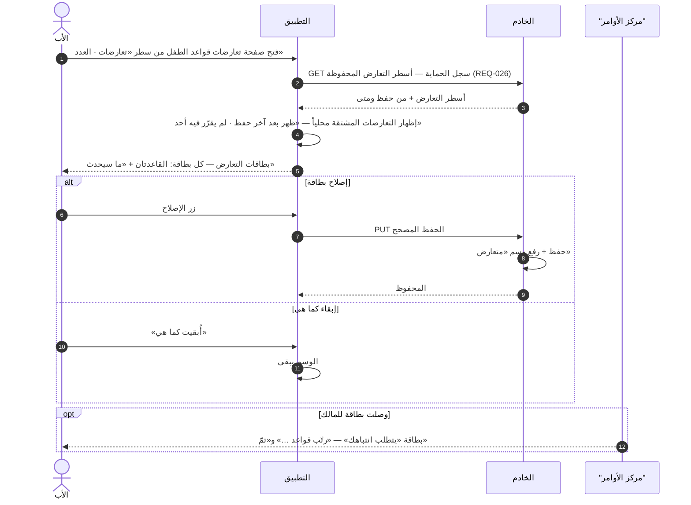
```mermaid
sequenceDiagram
    autonumber
    actor Father as الأب
    participant App as التطبيق
    participant Ktor as الخادم
    participant S109 as "مركز الأوامر"
    Father->>App: فتح صفحة تعارضات قواعد الطفل من سطر «تعارضات · العدد»
    App->>Ktor: GET سجل الحماية — أسطر التعارض المحفوظة (REQ-026)
    Ktor-->>App: أسطر التعارض + من حفظ ومتى
    App->>App: إظهار التعارضات المشتقة محلياً — «ظهر بعد آخر حفظ · لم يقرّر فيه أحد»
    App-->>Father: بطاقات التعارض — كل بطاقة: القاعدتان + «ما سيحدث»
    alt إصلاح بطاقة
        Father->>App: زر الإصلاح
        App->>Ktor: PUT الحفظ المصحح
        Ktor->>Ktor: حفظ + رفع وسم «متعارض»
        Ktor-->>App: المحفوظ
    else إبقاء كما هي
        Father->>App: «أُبقيت كما هي»
        App->>App: الوسم يبقى
    end
    opt وصلت بطاقة للمالك
        S109-->>Father: بطاقة «يتطلب انتباهك» — «رتّب قواعد …» و«تمّ»
    end
```

رُسم 2026-11-19 (Q-419 · Q-434): مخطط جديد — الصفحة تُفتح من سطر «تعارضات · العدد» في صفحة حماية الطفل («تنتظر قرارك» أو «أُبقيت كما هي»)؛ وتعرض التعارضات المحفوظة «كما هي» والتعارضات المشتقة محلياً «ظهر بعد آخر حفظ»؛ وكل بطاقة تُحسم بإصلاح أو إبقاء.

- بطاقة المالك في «يتطلب انتباهك» (S1-09 REQ-017) تصل عند حفظ غير المالك «كما هو»؛ وأزرارها «رتّب قواعد …» و«تمّ» — وجهتاها سؤال مفتوح (س-14).
- رقم الشاشة لصفحتي `conflict`/`conflicts` سؤال مفتوح (س-3) — لا رقم هنا.
- «العدد 95» في نص Q-419 مقابل المفاتيح الثابتة 94 — تعارض مسجَّل (س-7).

## 4. تدفق المستخدم (User Flow) — من السيناريوهات الثمانية (§2) (REQ-003/004/005/006/009/013/018/021/022/027/028/029/032/033 — Q-419)

يُقرأ منه: مسار الأب من فتح القواعد إلى الحفظ، ثم مسار التقييم على الجهاز — ست لوحات، والمسار السعيد في كل لوحة عمود واحد مستقيم. واللوحات مترابطة بعقد حدودية (شكل الملعب) + ملاحظات نصية تحتها.

### 4-أ. حفظ قاعدة أو جدول أو ترتيب — مع كشف التعارض (REQ-006/013/033 — Q-419)

```mermaid
flowchart TD
    FStart([الأب يفتح قواعد طفل]) --> FAct{ماذا يفعل؟}
    FAct -->|قاعدة أو جدول| FEdit[إنشاء أو تعديل قاعدة أو جدول]
    FEdit --> FConf{تعارض؟}
    FConf -->|مانع| FBlock[بطاقة المنع — صحّح الوقت]
    FBlock --> FEdit
    FConf -->|تحذيري| FWarn[بطاقة التعارض — ثلاثة مخارج]
    FWarn -->|عدّل هذا| FEdit
    FWarn -->|إصلاح جاهز| FSave
    FWarn -->|احفظ كما هو| FKeep[وسم متعارض + سطر في السجل]
    FKeep --> FSave
    FConf -->|لا| FSave[حفظ + تدقيق + دفع]
    FAct -->|ترتيب| FOrd[إعادة ترتيب الأنواع + معاينة]
    FOrd --> FOrdChk{يفتح في النوم أو المدرسة؟}
    FOrdChk -->|نعم| FOrdCard[بطاقة التعارض للترتيب]
    FOrdCard -->|احفظ كما هو| FKeep
    FOrdCard -->|راجع| FOrd
    FOrdChk -->|لا| FSave
    FSave --> Sync[الجهاز يبني القناع اليومي]
```

- إلى 4-د: الجهاز يبني القناع اليومي ثم يقيّم عند فتح التطبيق.

### 4-ب. تصفية الويب (REQ-028/029/030/031 — Q-343)

```mermaid
flowchart TD
    FStart([الأب يفتح تصفية الويب لطفل]) --> FWeb[ضبط قواعد التصفية + تجاوزات النطاقات]
    FWeb --> FWebChk{تعارض تطبيق مع موقعه؟}
    FWebChk -->|نعم| FWebCard[بطاقة التعارض — احظر موقعه أيضاً / اسمح بموقعه]
    FWebCard -->|إصلاح| FWeb
    FWebCard -->|احفظ كما هو| FWebVal
    FWebChk -->|لا| FWebVal{معرّف فئة غير معروف؟}
    FWebVal -->|نعم| FWebRej[رفض 400 — لا يُخزَّن شيء]
    FWebRej --> FWeb
    FWebVal -->|لا| FWebSave[حفظ + تدقيق + دفع MQTT]
    FWebSave --> FWebApply[VPN QProxy يطبق القواعد فوراً]
```

### 4-ج. الأوضاع (REQ-018/024/032/033 — Q-405)

```mermaid
flowchart TD
    FStart([الأب يفتح شاشة الأوضاع]) --> FModes[جاهزة + خاصة + وضع حر — سطح واحد]
    FModes --> FFree[تفعيل وضع حر — المالك وحده + مدة]
    FModes --> FApply[تطبيق وضع جاهز أو خاص — مدة + اختيار التقاطع]
    FModes --> FCustom[إنشاء / تعديل / حذف وضع خاص]
    FModes --> FEnd[إنهاء الوضع الساري لطفل]
    FFree --> FFreeSave[إنشاء جلسة وضع حر + تدقيق + دفع]
    FApply --> FApplyChk{الوضع يفتح تطبيقاً محظوراً؟}
    FApplyChk -->|نعم| FApplyCard[بطاقة التعارض للوضع]
    FApplyCard -->|احفظ كما هو| FApplySave
    FApplyCard -->|عدّل| FApply
    FApplyChk -->|لا| FApplySave[إنشاء mode_session + تدقيق + دفع]
    FCustom --> FCustomChk{الوضع يفتح تطبيقاً محظوراً؟}
    FCustomChk -->|نعم| FCustomCard[بطاقة التعارض للوضع الخاص]
    FCustomCard -->|احفظ كما هو| FCustomSave
    FCustomCard -->|عدّل| FCustom
    FCustomChk -->|لا| FCustomSave[حفظ التعريف + تدقيق + دفع]
    FEnd --> FEndSave[إنهاء mode_session + تدقيق + دفع]
```

### 4-د. التقييم — الوضع الساري (REQ-033 — Q-405)

```mermaid
flowchart TD
    CToReq([من 4-أ: الجهاز يبني القناع اليومي]) --> COpen([الطفل يفتح تطبيقاً])
    COpen --> CConn{اتصال؟}
    CConn -->|لا| COff[فرض من آخر إعداد مزامَن + نبضة 60 ثانية]
    COff --> CEval
    CConn -->|نعم| CEval[تقييم بسلّم من ثلاث درجات]
    CEval --> CFree{وضع حر سارٍ؟}
    CFree -->|نعم| CAllow[سماح — الاستخدام يُحسب ولا يُحدَّد]
    CFree -->|لا| CMode{وضع سارٍ؟}
    CMode -->|لا| CToMatch([إلى 4-هـ: ترتيب الأنواع])
    CMode -->|نوم| CBlockN[حظر — وقت نوم]
    CMode -->|دراسة| CStudy{التطبيق من تطبيقات الدراسة؟}
    CStudy -->|لا| CBlockS[حظر — وقت مدرسة، تطبيقات الدراسة فقط]
    CStudy -->|نعم — محظور| CBlockB[حظر — محظور]
    CStudy -->|نعم — بقي رصيد| CWarn{بقي 5 دقائق؟}
    CStudy -->|نعم — نفد الحد أو الحصة| CBlockQ[حظر فوري + شاشة الحظر]
    CMode -->|خاص NONE| CBlockM[حظر — الوضع لا يفتح شيئاً]
    CMode -->|خاص LIST| CList{التطبيق في قائمة الوضع؟}
    CList -->|لا| CBlockM
    CList -->|نعم — محظور| CBlockB
    CList -->|نعم — بلا حد داخل الوضع| CAllow
    CList -->|نعم — الحدود باقية وبقي رصيد| CWarn
    CList -->|نعم — الحدود باقية ونفد الحد أو الحصة| CBlockQ
    CMode -->|خاص ALL| CAllB{التطبيق محظور؟}
    CAllB -->|نعم| CBlockB
    CAllB -->|لا — بقي رصيد| CWarn
    CAllB -->|لا — نفد الحد أو الحصة| CBlockQ
    CWarn -->|نعم| CWarn2[تحذير بقي 5 دقائق — مرة في اليوم]
    CWarn2 --> CAllow
    CWarn -->|لا| CAllow
```

- عند أي حظر بحد أو حصة أو وقت: الطفل يطلب وقتاً إضافياً (4-و).

### 4-هـ. التقييم — ترتيب الأنواع (REQ-008/010/011/012 — Q-145)

```mermaid
flowchart TD
    CToMatch2([من 4-د: لا وضع سارٍ]) --> CMatch{أول نوع مطابق؟}
    CMatch -->|نوم| CBlockN[حظر — وقت نوم]
    CMatch -->|مدرسة والتطبيق ليس دراسة| CBlockS[حظر — وقت مدرسة، تطبيقات الدراسة فقط]
    CMatch -->|حد تطبيق أو حصة والمتبقي صفر| CBlockQ[حظر فوري + شاشة الحظر]
    CMatch -->|بقي رصيد| CWarn{بقي 5 دقائق؟}
    CWarn -->|نعم| CWarn2[تحذير بقي 5 دقائق — مرة في اليوم]
    CWarn2 --> CAllow[سماح — مع عرض المتبقي]
    CWarn -->|لا| CAllow
```

- عند أي حظر بحد أو حصة أو وقت: الطفل يطلب وقتاً إضافياً (4-و).

### 4-و. طلب وقت إضافي ومراجعة القواعد والعبث (REQ-003/004/005/021/022/027)

```mermaid
flowchart TD
    CReq([الطفل يطلب وقتاً إضافياً]) --> FDec{الأب يمنح مباشرة أم يسند مهمة؟}
    FDec -->|يمنح| CGrant[دقائق تضاف إلى حد التطبيق لهذا اليوم فقط]
    CGrant --> CEval2([إعادة التقييم — إلى 4-د])
    FDec -->|يسند مهمة| CTask[يكمل المهمة — تحقق الذكاء — نقاط — صرفها كوقت]
    CTask --> CEval2
    RStart([بلوغ الطفل 13 سنة أو استبدال جهازه]) --> RNotify[إشعار الأب لمراجعة قواعد التصفية]
    RNotify --> RReview{الأب يراجع القواعد؟}
    RReview -->|نعم| FWeb2([إلى 4-ب: ضبط قواعد التصفية])
    RReview -->|لا| RKeep[القواعد تبقى سارية كما هي]
    CTamperStart([مراقبة مستمرة على الجهاز]) --> CTamper{محاولة تعطيل الحماية؟}
    CTamper -->|نعم| CTAlert[تنبيه فوري للأب + محاولة إعادة تفعيل تلقائية]
    CTAlert --> COpen2([إلى 4-د: الطفل يفتح تطبيقاً])
```

أُعيد رسمه 2026-11-17 (Q-405): فُرع «الأوضاع» صار شاشة واحدة (جاهزة + خاصة + وضع حر) بمسارات التطبيق والإنشاء/التعديل/الحذف والإنهاء؛ والتقييم صار سلّم REQ-033 — حر، ثم وضع سارٍ (نوم/دراسة/NONE/LIST/ALL)، ثم ترتيب الأنواع.

قُسّم 2026-11-19 (Q-419 · Q-434) إلى ست لوحات 4-أ/4-ب/4-ج/4-د/4-هـ/4-و؛ وصار «تعارض؟» بطاقتين (مانع بلا «احفظ كما هو»، وتحذيري بثلاثة مخارج)؛ وأُضيف فحص التعارض في تصفية الويب والأوضاع؛ واللوحات مترابطة بعقد حدودية وملاحظات نصية.

- ملاحظة: زر SOS لا يُحظر أبداً — يعمل في كل مسار، في وقت النوم والمدرسة والوضع الحر (Q-067).
- ملاحظة: القواعد تتبع الطفل لا الجهاز — عند بلوغ الطفل 13 سنة تبقى قواعده سارية ويُشعَر الأب ليراجعها؛ وعند استبدال الجهاز تُعاد القواعد نفسها بالإقران الجديد (REQ-027).
- ملاحظة: تغيير الجدول يسري عند الاستلام؛ وإن صار الوقت الحالي محظوراً بالتغيير الجديد يُطبَّق الحظر فوراً حتى لو كان التطبيق مفتوحاً حينها (REQ-009).

## 5. مخطط تدفق البيانات (DFD — المستوى 1) — من §4/§5 (REQ-001/002/006/013/014/016/017/021/024/026/028/032/033 — Q-419)

يُقرأ منه: أين تُحفظ كل قاعدة وأين تُقرأ عند التقييم — لوحتان: إدارة القواعد والأوضاع، ثم الأوضاع والتقييم والعبث والمزامنة.

العمليات مرقمة 1.0–10.0، والمخازن D1–D12 جداول خادم (PostgreSQL)، والمخزنان L1–L2 مخازن عميل على جهاز الطفل (Drift/Outbox — محلية، ليست جداول خادم). و`enforcement_state` (D4) مرآة خادمية لحالة الجهاز — وتقييم الجهاز المحلي هو المرجع دون اتصال (REQ-025) — وتحمل الوضع الساري (`active_mode` و`active_mode_until` — Q-405). والأوضاع (REQ-024/032/033) عبر P10: دراسة/نوم/خاص بإنشاء `mode_session` (D12) — والحر عبر P5/D6 (إنشاء جلسة — لا قواعد ولا بناء قناع)؛ ووضع واحد لكل طفل، والجديد ينهي السابق. وصيغة المتبقي (REQ-002): المتبقي = الحصة + الإضافي − المستهلك؛ والحصة من `daily_total_quota.minutes_by_weekday` ليوم الأسبوع، والإضافي هو الوقت الممنوح/المصروف من S1-05 (`granted_time`)، والمستهلك من `app_usage_daily.seconds_used`. ولا حافة D5→P4: المستهلك في الصيغة هو `seconds_used` نفسه، لكنه يُحسب على الجهاز محلياً (نبضة خصم كل 60 ثانية) ولا يُقرأ من D5؛ وD5 مرآة خادمية يكتب فيها P7 فقط (مزامنة upsert — REQ-016) (Q-188).

- **تغطية نقاط §4:** التسلسلات في §3 تغطي التدفقات الأساسية فقط؛ وكل نقطة §4 تظهر هنا على الأقل: `GET/POST/PATCH/DELETE .../app-rules` (3-أ · P1) · `GET/PUT .../weekly-schedule` (3-ب · P2) · `GET/PUT .../rule-priority` (3-ج · P3) · `GET/PUT .../daily-total-quota` (P8 · D8) · `GET/PUT .../web-filter-rules` (3-ي · P9 · D9/D10) · `POST .../free-mode` و`POST .../free-mode/cancel` (3-هـ · P5) · `GET .../enforcement-state` (P4 · D4) · `GET .../tamper-events` و`POST .../tamper-events/{eventId}/resolve` (يقرآن/يكتبان D7 عبر Ktor — S10-11 · 3-و) · `POST .../mode-presets/{preset}` (دراسة/نوم/خاص عبر P10/D12، والحر عبر P5/D6 — 3-ط) · `GET/POST .../custom-modes` و`PUT/DELETE .../custom-modes/{modeId}` و`DELETE .../children/{childId}/active-mode` (P10 · D11/D12 — 3-ك) · `GET .../audit/protection` (التدفقات إلى AuditEvent). و§4-1 (قناة المنصة) و§4-3 (أحداث MQTT) خارج هذه الملاحظة. وهذه الملاحظة مرجع لنقاط §4 (بلا رسم كل نقطة في تسلسل).

### 5-أ. إدارة القواعد والأوضاع (REQ-001/002/006/013/026/028 — Q-419)

```mermaid
flowchart LR
    Father([الأب / البالغ])
    S109([مركز الأوامر S1-09])
    MQTT([وسيط MQTT])
    Audit([AuditEvent])

    subgraph Proc [العمليات]
        direction TB
        Check{فحص التعارض المحلي}
        P1(1.0 إدارة قواعد التطبيقات)
        P2(2.0 إدارة الجدول الأسبوعي)
        P3(3.0 إدارة ترتيب الأنواع)
        P8(8.0 إدارة الحصة الإجمالية اليومية)
        P9(9.0 إدارة قواعد تصفية الويب)
    end

    subgraph Stores [مخازن الخادم — PostgreSQL]
        direction TB
        D1[(D1 app_rule)]
        D2[(D2 weekly_schedule)]
        D3[(D3 rule_priority)]
        D8[(D8 daily_total_quota)]
        D9[(D9 web_category)]
        D10[(D10 web_filter_rule)]
    end

    Father -->|حفظ قاعدة أو جدول أو ترتيب أو حصة أو تصفية| Check
    Check -->|بلا تعارض| P1
    Check -->|بلا تعارض| P2
    Check -->|بلا تعارض| P3
    Check -->|بلا تعارض| P8
    Check -->|بلا تعارض| P9
    Check -->|بطاقة التعارض| Father
    Check -->|بطاقة للمالك إن حفظ غيره| S109
    S109 -->|بطاقة «يتطلب انتباهك»| Father
    P1 -->|حفظ القاعدة| D1
    P1 -->|rules-updated| MQTT
    P2 -->|حفظ الجدول| D2
    P2 -->|rules-updated| MQTT
    P3 -->|حفظ الترتيب| D3
    P3 -->|rules-updated| MQTT
    P8 -->|حفظ الحصة| D8
    P8 -->|rules-updated| MQTT
    D9 -->|الفئات الثلاثون| P9
    P9 -->|حفظ القواعد| D10
    P9 -->|rules-updated| MQTT
    P1 -->|تسجيل التغيير| Audit
    P2 -->|تسجيل التغيير| Audit
    P3 -->|تسجيل التغيير| Audit
    P8 -->|تسجيل التغيير| Audit
    P9 -->|تسجيل التغيير| Audit
    Audit -->|ملخص الحدث| MQTT
    MQTT -->|ملخص حدث التدقيق| Father
```

- فحص التعارض محلي في التطبيق على القواعد لديه (مرآة L1 في 5-ب) — مدخلاته D1/D2/D3/D8/D10/D11 عبر المرآة، لا استعلامات خادم هنا.
- تعيين الحصة للأب وحده (Q-184).
- مواضيع MQTT: `family/{family_id}/protection/rules-updated` · `family/{family_id}/protection/free-mode` · `family/{family_id}/protection/tamper` · `family/{family_id}/device/{device_id}/state` · ملخص التدقيق `family/{family_id}/protection/audit`.

### 5-ب. الأوضاع والوضع الحر والتقييم والعبث والمزامنة (REQ-014/016/017/021/024/032/033)

```mermaid
flowchart LR
    Father([الأب / البالغ])
    Child([الطفل / المراهق])
    S101([الغلاف S1-01])
    S105([نظام المكافآت S1-05])
    S109([مركز الأوامر S1-09])
    MQTT([وسيط MQTT])
    Audit([AuditEvent])

    subgraph Proc [العمليات]
        direction TB
        P4(4.0 محرك التقييم — على الجهاز)
        P5(5.0 الوضع الحر)
        P6(6.0 كشف العبث وإعادة التفعيل)
        P7(7.0 مزامنة دون اتصال)
        P10(10.0 إدارة الأوضاع وتطبيقها)
    end

    subgraph ServerStores [مخازن الخادم — PostgreSQL]
        direction TB
        D4[(D4 enforcement_state)]
        D5[(D5 app_usage_daily)]
        D6[(D6 free_mode_session)]
        D7[(D7 tamper_event)]
        D11[(D11 custom_mode)]
        D12[(D12 mode_session)]
    end

    subgraph ClientStores [مخازن العميل — على جهاز الطفل]
        direction TB
        L1[(L1 مرآة Drift — قواعد + جدول + ترتيب + قناع يومي)]
        L2[(L2 Outbox — أحداث استخدام وعبث)]
    end

    Father -->|تفعيل أو إلغاء وضع حر| P5
    P5 -->|حفظ الجلسة| D6
    P5 -->|تفعيل الحر ينهي الجلسة السارية| D12
    P5 -->|free-mode| MQTT
    P5 -->|تسجيل التفعيل والانتهاء والإلغاء المبكر| Audit
    Father -->|إنشاء / تعديل / حذف وضع خاص| P10
    Father -->|تطبيق وضع / إنهاء الوضع الساري| P10
    P10 -->|حفظ التعريف| D11
    P10 -->|حفظ الجلسة| D12
    P10 -->|تطبيق وضع ينهي جلسة الوضع الحر| D6
    P10 -->|rules-updated| MQTT
    P10 -->|تسجيل الإنشاء والتعديل والحذف والتطبيق والإنهاء| Audit
    P6 -->|tamper| MQTT
    P4 -->|state| MQTT
    MQTT -->|دفع القواعد والوضع| L1
    L1 -->|القواعد + القناع + الوضع الساري| P4
    S101 -->|قناة familyos/enforcement| P4
    S105 -->|الممنوح يدخل في الإضافي| P4
    Child -->|فتح تطبيق| P4
    P4 -->|قرار سماح أو حظر| Child
    P4 -->|حالة الفرض| D4
    P4 -->|حالة الفرض + المتبقي| S105
    D4 -->|حالة الفرض| S109
    P4 -->|أحداث استخدام| L2
    L2 -->|تفريغ idempotent| P7
    P7 -->|حفظ الاستهلاك| D5
    P7 -->|القواعد الجديدة| L1
    P7 -->|حفظ حدث العبث| D7
    Child -->|تعطيل Accessibility أو إلغاء تثبيت| P6
    P6 -->|حدث عبث — دون اتصال: Outbox| L2
    P6 -->|تنبيه فوري| S109
    S109 -->|تنبيه alert نوع system| Father
    P6 -->|محاولة إعادة تفعيل تلقائية| P4
    P6 -->|تسجيل العبث| Audit
```

- P4 يقرأ الحصة اليومية من D8 (5-أ)؛ وD5 مرآة خادمية يكتب فيها P7 فقط.
- دفع القواعد إلى L1 يتم عبر MQTT؛ والخادم Ktor هو من ينشرها — وحدّ Ktor (خارجي أم جزء من النظام) سؤال مفتوح (س-13).
- الوسيط Eclipse Mosquitto 2.x — TLS 1.2+ على 8883 + mTLS (Q-168).

أُعيد رسمه 2026-11-17 (Q-405): أُضيفت العملية P10 (إدارة الأوضاع الخاصة وتطبيق الأوضاع) والمخزنان D11 (`custom_mode`) وD12 (`mode_session`)؛ والوضع الساري يُدفع إلى مرآة العميل L1 ويُقرأ في التقييم P4؛ وتفعيل الحر ينهي جلسة الوضع الساري وتطبيق وضع ينهي جلسة الحر.

قُسّم 2026-11-19 (Q-419 · Q-434) إلى لوحتين 5-أ/5-ب؛ وأُضيف فحص التعارض المحلي (Check) قبل كل حفظ؛ وقُصّرت تسميات الحواف ونُقلت مواضيع MQTT الطويلة إلى النص تحت اللوحتين؛ وKtor بقي كما رُسم (س-13). والصناديق التجميعية (عمليات/مخازن) أُعيدت بعد فحص العين: النسخة المسطحة بلا صناديق نثرت العقد على كامل العرض وصعُب تتبعها، فعادت الصناديق كما في DFD الأصلي.

## 6. مخطط النشاط (Activity) — دورة حياة القاعدة والفرض (REQ-003/004/005/006/013/018/019/021/022/024/032/033 — Q-419)

يُقرأ منه: دورة حياة القاعدة من إنشائها إلى فرضها على الجهاز — ثلاث لوحات: مسار الأب، ومسار الخادم، ومسار الطفل ووحدة Kotlin.

المسارات الأربعة (الأب / الطفل / وحدة Kotlin / الخادم) كمسارات متوازية في ثلاث لوحات. والأنشطة الخلفية (نبضة الخصم كل 60 ثانية + مراقبة العبث + تفريغ Outbox) تعمل **بالتوازي** مع استخدام التطبيق.

### 6-أ. مسار الأب (REQ-003/006/013/018/024/032/033 — Q-419)

```mermaid
flowchart TD
    subgraph Father [الأب]
        direction TB
        F1([فتح قواعد طفل])
        F2[إنشاء أو تعديل قاعدة أو جدول]
        FChk{تعارض؟}
        FBlock[بطاقة المنع — صحّح الوقت]
        FCard[بطاقة التعارض — ثلاثة مخارج]
        FKeep[وسم متعارض + سطر في السجل]
        F3[إعادة ترتيب الأنواع — مع معاينة النتيجة]
        FOrdChk{يفتح في النوم أو المدرسة؟}
        FOrdCard[بطاقة التعارض للترتيب]
        F4[تفعيل وضع حر — مدة محددة]
        F4a[تطبيق وضع — جاهز أو خاص — مدة محددة]
        F4b[إنشاء / تعديل / حذف وضع خاص]
        F4c[إنهاء الوضع الساري لطفل]
        F5[منح وقت مباشرة أو إسناد مهمة]
        F6[مراجعة تنبيه عبث]
        F8[مراجعة صفحة تعارضات الطفل]
        F7([إغلاق لوحة الأهل])
    end
    InC([من 6-ج: طلب وقت إضافي])
    InV([من 6-ب: تنبيه عبث])
    SV([حفظ في الخادم — V1/V2/V3])
    F1 --> F2
    F2 --> FChk
    FChk -->|مانع| FBlock
    FBlock --> F2
    FChk -->|تحذيري| FCard
    FCard -->|عدّل هذا| F2
    FCard -->|إصلاح جاهز| SV
    FCard -->|احفظ كما هو| FKeep
    FKeep --> SV
    FChk -->|لا| SV
    F1 --> F3
    F3 --> FOrdChk
    FOrdChk -->|نعم| FOrdCard
    FOrdCard -->|احفظ كما هو| SV
    FOrdCard -->|راجع| F3
    FOrdChk -->|لا| SV
    F1 --> F4
    F1 --> F4a
    F1 --> F4b
    F1 --> F4c
    F4 --> SV
    F4a --> SV
    F4b --> SV
    F4c --> SV
    F1 --> F8
    F8 --> SV
    InC --> F5
    F5 --> SV
    InV --> F6
    F6 --> F7
```

### 6-ب. مسار الخادم (REQ-001/006/013/024/026/032/033)

```mermaid
flowchart TD
    subgraph Server [الخادم — Ktor]
        direction TB
        InA([من 6-أ: حفظ])
        InK([من 6-ج: حدث عبث])
        V1[POST .../app-rules]
        V2[PUT .../weekly-schedule]
        V3[PUT .../rule-priority]
        V4[POST .../free-mode]
        V8["POST .../mode-presets/{preset}"]
        V9["نقاط الأوضاع الخاصة"]
        V5["MQTT rules-updated / free-mode"]
        V6[تسجيل التدقيق]
        V7[تنبيه عبث إلى S1-09]
    end
    OutK([إلى 6-ج: استلام القواعد])
    OutF([إلى 6-أ: مراجعة تنبيه عبث])
    InA --> V1
    InA --> V2
    InA --> V3
    InA --> V4
    InA --> V8
    InA --> V9
    V1 --> V5
    V2 --> V5
    V3 --> V5
    V4 --> V5
    V8 --> V5
    V9 --> V5
    V1 --> V6
    V2 --> V6
    V3 --> V6
    V4 --> V6
    V8 --> V6
    V9 --> V6
    V5 --> OutK
    InK --> V7
    V7 --> V6
    V7 --> OutF
```

- نقاط الأوضاع الخاصة V9: `GET/POST .../custom-modes` + `PUT/DELETE .../custom-modes/{modeId}` + `DELETE .../children/{childId}/active-mode`.

### 6-ج. مسار الطفل ووحدة Kotlin (REQ-003/004/005/013/021/022/033)

```mermaid
flowchart TD
    subgraph Child [الطفل]
        direction TB
        C1([فتح تطبيق])
        C2[استخدام التطبيق]
        C3[طلب وقت إضافي من شاشة الحظر]
        C4[محاولة تعطيل الحماية]
    end
    subgraph Kotlin [وحدة Kotlin — S1-01]
        direction TB
        K1[استلام القواعد وبناء القناع اليومي]
        K2[تقييم بسلّم من ثلاث درجات]
        K3{النتيجة؟}
        K4[سماح + عرض المتبقي]
        K5[تحذير قبل 5 دقائق]
        K6[حظر فوري + شاشة الحظر]
        K7[نبضة خصم كل 60 ثانية]
        K8[كشف العبث]
        K9[محاولة إعادة تفعيل تلقائية]
    end
    InV([من 6-ب: دفع القواعد])
    OutF([إلى 6-أ: منح وقت أو إسناد مهمة])
    OutS([إلى 6-ب: تنبيه عبث])
    OutF2([إلى 6-أ: مراجعة تنبيه عبث])
    InV --> K1
    K1 --> K2
    K1 --> K7
    C1 --> K2
    K2 --> K3
    K3 -->|سماح| K4
    K3 -->|اقتراب النفاد| K5
    K5 --> K4
    K3 -->|حظر| K6
    K4 --> C2
    K6 --> C3
    C3 --> OutF
    C2 --> C4
    C4 --> K8
    K8 --> K9
    K8 --> OutS
    K9 -->|نجحت| K2
    K9 -->|فشلت| OutF2
```

أُعيد رسمه 2026-11-17 (Q-405): التقييم صار سلّم REQ-033؛ وأُضيفت عقد الأوضاع (تطبيق وضع F4a، وإنشاء/تعديل/حذف وضع خاص F4b، وإنهاء الوضع الساري F4c) مع نقطتي الخادم V8/V9.

قُسّم 2026-11-19 (Q-419 · Q-434) إلى ثلاث لوحات TD — 6-أ مسار الأب، 6-ب مسار الخادم، 6-ج مسار الطفل ووحدة Kotlin — مترابطة بعقد حدودية؛ وأُضيف فحص التعارض (FChk/FOrdChk) ومراجعة صفحة التعارضات (F8) في 6-أ؛ وقُصّر V9 ونُقلت نقاطه إلى النص تحت 6-ب؛ وأُضيفت حافة K4→C2 (السماح يفتح الاستخدام) لإكمال مسار الطفل.

- عند انتهاء الوضع الحر يعود التقييم فوراً — والتطبيق المفتوح المخالف يُغلق مع شاشة الحظر (REQ-019/004).
- الحالات الحدية (§7): تغيير ساعة الجهاز يدوياً لا يؤثر — النبضة بالساعة الرتيبة؛ وتعديلان متزامنان من والدين → `409 VERSION_CONFLICT` وإعادة تحميل؛ واستبدال الجهاز يعيد القواعد نفسها بالإقران الجديد — القواعد تتبع الطفل لا الجهاز.
